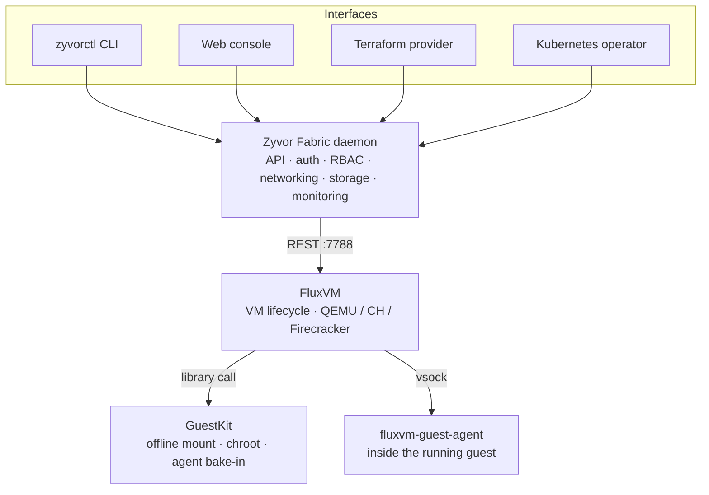

<div align="center">

# Zyvor Fabric

### Private cloud control plane for Linux — VMs, networking, storage, and security from one daemon.

[](LICENSE)
[](https://github.com/zyvorai/fabric/actions/workflows/ci.yml)
[](backend/)
[](docs/KUBERNETES.md)
[](https://github.com/zyvorai/fluxvm)
[](https://github.com/zyvorai/guestkit)

[Quick start](#quick-start) · [Deploy](#deploy) · [Kubernetes](#run-on-kubernetes) · [Why Fabric](#why-zyvor-fabric) · [Architecture](#built-on-fluxvm--guestkit) · [Docs](#documentation)

</div>

---

Run enterprise-grade virtual machines, software-defined networking, pluggable storage, and security policy on **any Linux server with KVM** — no vCenter, no heavyweight hypervisor stack, no systemd hard-requirement. One Rust daemon exposes **480+ REST endpoints** and live WebSocket channels; drive it from a **CLI, web dashboard, Kubernetes operator, or Terraform provider** — all four talk to the same daemon, so nothing drifts.

Zyvor Fabric doesn't implement VM execution itself. It's the orchestration, API, auth, and UX layer on top of two independent sibling projects — [FluxVM](https://github.com/zyvorai/fluxvm) (VM engine) and [GuestKit](https://github.com/zyvorai/guestkit) (offline disk tooling).

### Feature guides

- **[Customer Feature Guide](docs/zyvor-fabric-customer-feature-guide.md)** — **55 features** across **9 areas** (also [PDF](docs/zyvor-fabric-customer-feature-guide.pdf))
- **[Customer manual](docs/customer/README.md)** — every console surface, page by page

---

## Quick start

```bash
git clone https://github.com/zyvorai/fabric.git && cd fabric
make build && sudo make install

# Start the daemon (systemd optional)
sudo zyvor-fabricd
# or: sudo systemctl enable --now zyvor-fabricd

# CLI
zyvorctl list
zyvorctl create web-01 --image fedora-41 --cpus 2 --memory 4096

# Web UI → https://localhost:9095  (console at /app)
```

| Goal | Path |
|------|------|
| Local eval with containers | `make docker-up` → [docs/DOCKER.md](docs/DOCKER.md) |
| Bare-metal remote host | `./scripts/deploy remote USER@HOST` |
| **Kubernetes (k3s lab / Helm)** | [`./scripts/deploy k8s USER@HOST`](#run-on-kubernetes) → [docs/KUBERNETES.md](docs/KUBERNETES.md) |
| Declarative VMs | `zyvorctl apply -f config.yaml` |
| Terraform | [terraform-provider/](terraform-provider/) |
| K8s operator (CRDs → API) | [operator/](operator/) |
| Ansible | [ansible/](ansible/) |
| Dev on a laptop | [QUICKSTART.md](QUICKSTART.md) |

Default ports: **9095** (API + UI), **7788** (FluxVM on localhost).

---

## Deploy

Four first-class ways to run Fabric. Pick one:

```text
┌─────────────────┬──────────────────┬──────────────────┬─────────────────┐
│  Bare metal     │  Docker/Podman   │  Kubernetes      │  Operator only  │
│  systemd/binary │  compose         │  DaemonSets      │  CRDs → API     │
├─────────────────┼──────────────────┼──────────────────┼─────────────────┤
│  Production     │  Local eval      │  Lab k3s /       │  GitOps VMs     │
│  hosts          │                  │  in-cluster CP   │  against fabricd│
└─────────────────┴──────────────────┴──────────────────┴─────────────────┘
```

### Bare metal (systemd)

```bash
./scripts/deploy remote sus@HOST
./scripts/deploy remote sus@HOST --quick    # skip OS deps
./scripts/deploy check sus@HOST
```

Installs `zyvor-fabricd` + web UI, opens `0.0.0.0:9095` (HTTPS, self-signed by default). Admin password is written to `/var/lib/zyvor-fabricd/.admin_password` on first start.

### Docker / Podman

```bash
./scripts/build-container-images.sh   # needs ../FluxVM + ../guestkit
make docker-up                        # hostNetwork + /dev/kvm
# → http://localhost:9095   admin / eval-admin-only
```

See [docs/DOCKER.md](docs/DOCKER.md) for host prerequisites (`nbd`, KVM, rootful engine, cgroup v2).

---

## Run on Kubernetes

Fabric on Kubernetes uses the same **lab packaging pattern as Ragnarok** (manifests, Helm, remote `k3s ctr import`), but workloads are **privileged `hostNetwork` DaemonSets** — required for nftables, KVM, and FluxVM on `127.0.0.1:7788` (same model as compose).

> Full guide: **[docs/KUBERNETES.md](docs/KUBERNETES.md)**

### Lab remote (recommended)

```bash
# First time: build images on the node, import into k3s, apply manifests
./scripts/deploy k8s sus@HOST

# Later: re-apply + rollout only
./scripts/deploy k8s sus@HOST --quick

# Remove
./scripts/deploy k8s sus@HOST --uninstall
```

| Surface | Port |
|---------|------|
| UI + API (NodePort) | **30095** |
| UI + API (hostNetwork) | **9095** |
| FluxVM | **7788** (node-local) |

Open `http://HOST:30095/` after deploy. Set `FABRIC_ADMIN_PASSWORD` to pin the admin login (otherwise a random password is printed).

### Local kubectl / Helm

```bash
# Manifests (images must be visible to the cluster)
make k8s-deploy
# or: BUILD_IMAGES=true ./scripts/deploy-k8s.sh

# Helm
helm upgrade --install zyvor-fabric ./charts/zyvor-fabric \
  --namespace zyvor-fabric --create-namespace \
  --set security.adminPassword='...' \
  --set security.jwtSecret="$(openssl rand -base64 32)"
```

### Platform chart vs operator

| Piece | What it does |
|-------|----------------|
| **`charts/zyvor-fabric`** / `k8s/base/` | Runs **fabricd + FluxVM** in the cluster |
| **`operator/charts/zyvor-fabricd-operator`** | Watches `VirtualMachine` CRs and calls an **already-running** fabricd API |

Point the operator at NodePort or the node IP (`ZYVOR_FABRICD_URL=http://NODE_IP:30095`). Do not expect ClusterIP DNS to replace `hostNetwork` across nodes.

### Requirements (K8s)

- Node with `/dev/kvm`
- Namespace PSS **privileged** (cannot run restricted)
- Rootful `podman` or `docker` on the build host for image builds
- Optional: sibling checkouts `../FluxVM` and `../guestkit` for the FluxVM image

---

## Why Zyvor Fabric

| Problem | Zyvor Fabric answer |
|---------|---------------------|
| Private cloud usually means a heavy hypervisor stack | A lightweight, disposable VM engine underneath ([FluxVM](https://github.com/zyvorai/fluxvm)) — no systemd dependency, no vCenter |
| No unified API across interfaces | 480+ REST endpoints and 3 WebSocket channels, one daemon, four front doors |
| Scripting vs. GUI is usually either/or | CLI (`zyvorctl`) + web console + Terraform + Kubernetes operator, all first-class |
| Enterprise needs RBAC, audit, and encryption | JWT auth, roles, audit export, encryption at rest |
| GPU passthrough is bolted on elsewhere | Generic PCI/VFIO passthrough REST API on Linux KVM |
| Guest images ship without your tooling | Offline image customization via [GuestKit](https://github.com/zyvorai/guestkit) |

---

## Built on FluxVM + GuestKit

Zyvor Fabric is a thin, opinionated layer. It doesn't own a hypervisor or a guest-filesystem library — it composes two sibling projects:

### [FluxVM](https://github.com/zyvorai/fluxvm) — the VM engine

`zyvor-fabricd` never touches QEMU directly. It talks to a local FluxVM instance over REST (`127.0.0.1:7788`) for VM process lifecycle, disks, console/VNC, cgroups, and per-VM network namespaces. Backends (QEMU, Cloud Hypervisor, Firecracker) are an FluxVM-side concern.

### [GuestKit](https://github.com/zyvorai/guestkit) — guest-side tooling

Before first boot, FluxVM uses GuestKit to reach inside disk images (NBD mount, chroot customize, bake in `fluxvm-guest-agent`) without a libguestfs appliance VM.



**Fabric decides what should exist; FluxVM makes it exist; GuestKit prepares the disk.** Each layer is independently useful and Apache-2.0 licensed.

---

## Platform at a glance

| Metric | Value |
|--------|-------|
| Rust crates | 48 |
| REST endpoints | 480+ |
| LOC | ~87K (60K Rust + 27K TS) |
| Interfaces | 4 (CLI, Web, Operator, Terraform) |
| Web pages | 80+ console routes + marketing |
| Deploy modes | Bare metal · Docker · Kubernetes · Operator |

---

## Documentation

| Goal | Document |
|------|----------|
| **Docs index** | [docs/README.md](docs/README.md) |
| **Kubernetes deploy** | [docs/KUBERNETES.md](docs/KUBERNETES.md) |
| **Docker / Podman** | [docs/DOCKER.md](docs/DOCKER.md) |
| Quick start (dev) | [QUICKSTART.md](QUICKSTART.md) |
| Features | [FEATURES.md](FEATURES.md) |
| Architecture | [docs/architecture.md](docs/architecture.md) |
| FluxVM driver | [docs/guides/vm-drivers/fluxvm.md](docs/guides/vm-drivers/fluxvm.md) |
| Web UX | [docs/web-ui.md](docs/web-ui.md) |
| User stories | [docs/USER_STORIES.md](docs/USER_STORIES.md) |
| SCIM identity | [docs/scim-identity.md](docs/scim-identity.md) |
| Host maintenance | [docs/host-lifecycle.md](docs/host-lifecycle.md) |
| Customer manuals | [docs/customer/README.md](docs/customer/README.md) |
| Full catalog | [docs/index.md](docs/index.md) |
| Integrations | [integrations/](integrations/) |
| Operator | [operator/README.md](operator/README.md) |

---

## Zyvor platform stack

| Product | Role |
|---------|------|
| **[FluxVM](https://github.com/zyvorai/fluxvm)** | Disposable compute engine — QEMU / Cloud Hypervisor / Firecracker |
| **[GuestKit](https://github.com/zyvorai/guestkit)** | Offline VM disk inspection, repair, and customization |
| **hypercluster** | Bare-metal Kubernetes bootstrap |
| **machina** | Physical hypervisor OS (libvirt/KVM) |
| **zeus-os** | Cloud / KubeVirt control plane |
| **hermes** | Application layer for Kubernetes |
| **forge** | AI infrastructure on Kubernetes |
| **hypersdk / hyper2kvm** | Multi-cloud VM migration |
| **packetwolf** | Kernel-native network intelligence |
| **Axiom** | k8s-native private cloud control plane |
| **Ragnarok** | AI-powered KubeVirt VM management |
| **Veyron** | KubeVirt VM command center |
| **IronWolf** | Metal3 bare-metal automation |
| **Zyvor Fabric** | Private cloud with a pluggable VM engine (**this repo**) |

→ [zyvor.dev](https://zyvor.dev)

---

## Development

```bash
make build          # backend + web
make test           # Rust + web tests
make lint && make fmt
make helm-lint      # charts/zyvor-fabric
```

Historical build summaries in the repo root are snapshots — **`docs/` and this README are authoritative.**

---

## License

Apache License 2.0 — see [LICENSE](LICENSE) and [NOTICE](NOTICE).
