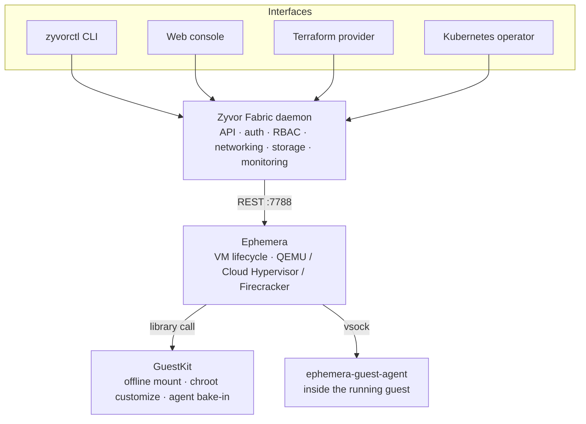

<div align="center">

# Zyvor Fabric

### A private cloud control plane for Linux — VMs, networking, storage, and security over one daemon, driven by a pluggable, disposable VM engine.

[](LICENSE)
[](https://github.com/zyvorai/fabric/actions/workflows/ci.yml)
[](backend/)
[](https://github.com/zyvorai/ephemera)
[](https://github.com/zyvorai/guestkit)

[Quick start](#quick-start) · [Why Zyvor Fabric](#why-zyvor-fabric) · [Sibling projects & architecture](#built-on-ephemera--guestkit) · [Docs](#documentation)

</div>

---

Run enterprise-grade virtual machines, software-defined networking, pluggable storage, and security policy on **any Linux server with KVM** — no vCenter, no heavyweight hypervisor stack, no systemd hard-requirement. One Rust daemon exposes **480+ REST endpoints** and live WebSocket channels; drive it from a **CLI, web dashboard, Kubernetes operator, or Terraform provider** — all four talk to the same daemon, so nothing drifts.

Zyvor Fabric doesn't implement VM execution itself. It's the orchestration, API, auth, and UX layer on top of two independent, permissively-licensed sibling projects — see [Built on Ephemera + GuestKit](#built-on-ephemera--guestkit) below for how that split actually works end to end.

### 📖 Feature guide

- **[Customer Feature Guide](docs/zyvor-fabric-customer-feature-guide.md)** — all **55 features** across **9 areas**, grounded in the product's actual capabilities. Also a print-ready **[PDF](docs/zyvor-fabric-customer-feature-guide.pdf)**.
- **[Page-by-page customer manual](docs/customer/README.md)** — getting started, admin basics, and a guide for every console surface (PDFs under `docs/customer/pdf/`).

---

## Why Zyvor Fabric

| Problem | Zyvor Fabric answer |
|---------|---------------------|
| Private cloud usually means a heavy hypervisor stack | A lightweight, disposable VM engine underneath ([Ephemera](https://github.com/zyvorai/ephemera)) — no systemd dependency, no vCenter |
| No unified API across interfaces | 480+ REST endpoints and 3 WebSocket channels, one daemon, four front doors |
| Scripting vs. GUI is usually either/or | CLI (`zyvorctl`) + web console + Terraform provider + Kubernetes operator, all first-class |
| Enterprise needs RBAC, audit, and encryption | JWT auth, roles, audit export, encryption at rest, out of the box |
| GPU passthrough is bolted on elsewhere | First-class GPU API on Linux KVM |
| Guest images ship without your tooling baked in | Offline image customization via [GuestKit](https://github.com/zyvorai/guestkit) — inject packages, files, and the in-guest agent before first boot, no appliance VM needed |

---

## Built on Ephemera + GuestKit

Zyvor Fabric is deliberately a thin, opinionated layer. It doesn't own a hypervisor implementation or a guest-filesystem library — it composes two sibling projects, each useful on its own:

### [Ephemera](https://github.com/zyvorai/ephemera) — the VM engine

> *Disposable compute engine for QEMU, Cloud Hypervisor, and Firecracker.*

`zyvor-fabricd` never touches QEMU directly. It talks to a local Ephemera instance over a plain REST API (`127.0.0.1:7788`) for everything that's actually *running a VM*: process lifecycle, disk provisioning (qcow2 CoW clones, LVM-thin, NBD, Ceph RBD), console/VNC/serial access, cgroup resource control, and per-VM network namespaces. Swapping VM backends — QEMU, Cloud Hypervisor, Firecracker — is an Ephemera-side concern; Fabric just calls the same API regardless of which one is behind it.

### [GuestKit](https://github.com/zyvorai/guestkit) — guest-side tooling

> *Pure-Rust VM disk inspection — zero boot, zero agents, instant insight.*

Before a VM ever boots, Ephemera uses GuestKit as a library to reach *inside* its disk image: mounting the guest filesystem via NBD, chrooting in to install packages or run commands, writing files, and baking in `ephemera-guest-agent` (the vsock-based in-guest agent that powers Fabric's browser Terminal) — all without a libguestfs appliance VM. The same GuestKit also ships as its own standalone CLI for offline migration assurance, boot-readiness scoring, and disk repair, independent of Fabric or Ephemera entirely.



Practically, that means: **Fabric decides *what* infrastructure should exist; Ephemera makes it exist; GuestKit prepares the disk before it does.** Each layer is independently useful, independently versioned, and Apache-2.0 licensed — you can take GuestKit or Ephemera without Fabric, but Fabric always needs both underneath it.

---

## Platform at a Glance

| Metric | Value |
|--------|-------|
| Rust crates | 40 |
| REST endpoints | 480+ |
| LOC | ~87K (60K Rust + 27K TS) |
| Interfaces | 4 (CLI, Web, Operator, Terraform) |
| Web pages | 80+ console routes + marketing |

---

## Quick Start

```bash
git clone https://github.com/zyvorai/fabric.git && cd fabric
make build && sudo make install

# CLI
zyvorctl list
zyvorctl create web-01 --image fedora-41 --cpus 2 --memory 4096

# Web UI → http://localhost:9095 (marketing) · console at /app
sudo zyvor-fabricd                   # run directly (no systemd required)
# — or, if you'd rather run it under systemd (optional, not required):
sudo systemctl start zyvor-fabricd
```

| Scenario | Path |
|----------|------|
| Declarative VMs | `zyvorctl apply -f config.yaml` |
| Docker / Podman | `docker compose up -d` (or `podman compose up -d`) — see [docs/DOCKER.md](docs/DOCKER.md) |
| Terraform | [terraform-provider/](terraform-provider/) |
| K8s operator | [operator/](operator/) |
| Ansible | [ansible/](ansible/) |

---

## Documentation

| Goal | Document |
|------|----------|
| Docs index | [docs/README.md](docs/README.md) |
| Docker / Podman | [docs/DOCKER.md](docs/DOCKER.md) |
| User stories | [docs/USER_STORIES.md](docs/USER_STORIES.md) |
| Integrations | [integrations/](integrations/) |

## Zyvor Platform Stack

| Product | Role |
|---------|------|
| **[Ephemera](https://github.com/zyvorai/ephemera)** | Disposable compute engine — QEMU / Cloud Hypervisor / Firecracker |
| **[GuestKit](https://github.com/zyvorai/guestkit)** | Pure-Rust offline VM disk inspection, repair, and customization |
| **hypercluster** | Bare-metal Kubernetes bootstrap |
| **machina** | Physical hypervisor OS (libvirt/KVM) |
| **zeus-os** | Cloud / KubeVirt control plane |
| **hermes** | Application layer for Kubernetes |
| **forge** | AI infrastructure on Kubernetes |
| **hypersdk / hyper2kvm** | Multi-cloud VM migration |
| **packetwolf** | Kernel-native network intelligence |
| **Axiom** | k8s-native private cloud control plane |
| **Veyron** | KubeVirt VM command center |
| **IronWolf** | Metal3 bare-metal automation |
| **Zyvor Fabric** | Private cloud with a pluggable VM engine (this repo) |

→ [zyvor.dev](https://zyvor.dev)

---

## Development

See project docs for CI, testing, and contribution guidelines. Historical build summaries in the repo root are snapshots — **`docs/` and this README are authoritative.**

---

## License

Apache License 2.0 — see [LICENSE](LICENSE) and [NOTICE](NOTICE).
