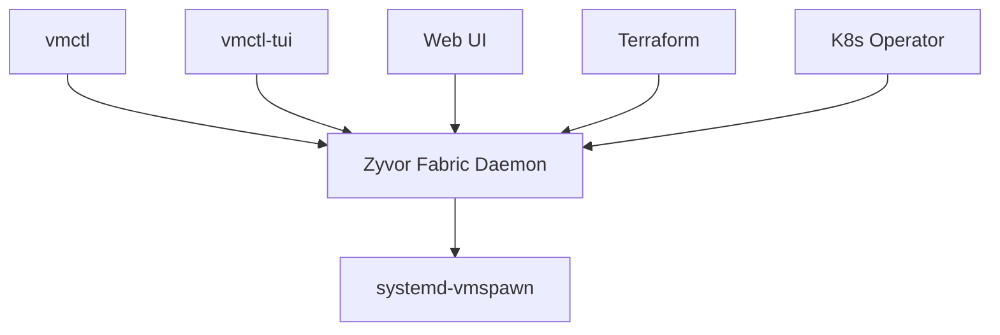

# Zyvor Fabric

**A systemd-native private cloud control plane.**


## 📖 Feature Guide

**[Zyvor Fabric — Customer Feature Guide](docs/zyvor-fabric-customer-feature-guide.md)** — a complete, customer-facing reference covering all **55 features** across **9 areas**, grounded in the product's actual capabilities. Also available as a print-ready **[PDF](docs/zyvor-fabric-customer-feature-guide.pdf)**.

Clustering, networking, security, storage, operators, Terraform, monitoring, HA, and GPU support on Linux — manage infrastructure through **CLI, TUI, web dashboard, Kubernetes operator, or Terraform**. Proxmox + KubeVirt UX without the heavyweight stack.

```text
┌──────────────────────────────────────────────────────────────┐
│  Interfaces   vmctl CLI · vmctl-tui · Web UI · TF · Operator   │
├──────────────────────────────────────────────────────────────┤
│  Daemon       Zyvor Fabric — 480+ REST endpoints · WebSocket │
├──────────────────────────────────────────────────────────────┤
│  Runtime      systemd-vmspawn · systemd-machined · KVM       │
└──────────────────────────────────────────────────────────────┘
```

Part of the [Zyvor](https://zyvor.dev) product family.

---

## Why Zyvor Fabric

| Problem | Zyvor Fabric answer |
|---------|---------------------|
| Private cloud = heavy hypervisor stack | systemd-native VMs via vmspawn |
| No unified API across interfaces | 480+ REST endpoints, 3 WebSocket channels |
| Scripting vs GUI is either/or | CLI + TUI + web + Terraform + K8s operator |
| Enterprise needs RBAC + audit | JWT, roles, audit export, encryption at rest |
| GPU passthrough is bolted on | First-class GPU API on Linux KVM |

---

## Platform at a Glance

| Metric | Value |
|--------|-------|
| Rust crates | 40 |
| REST endpoints | 480+ |
| LOC | ~87K (60K Rust + 27K TS) |
| Interfaces | 5 (CLI, TUI, Web, Operator, Terraform) |
| Web pages | 37+ |

---

## Quick Start

```bash
git clone https://github.com/ssahani/zyvor-fabric.git && cd zyvor-fabric
make build && sudo make install

# CLI
vmctl vm list
vmctl vm create --name web-01 --cpus 2 --memory 4G

# TUI
vmctl-tui

# Web UI → https://localhost:8443
sudo systemctl start zyvor-fabric
```

| Scenario | Path |
|----------|------|
| Declarative VMs | `vmctl apply -f config.yaml` |
| Terraform | [terraform-provider/](terraform-provider/) |
| K8s operator | [operator/](operator/) |
| Ansible | [ansible/](ansible/) |

---

## Architecture



---

## Documentation

| Goal | Document |
|------|----------|
| Docs index | [docs/README.md](docs/README.md) |
| User stories | [docs/USER_STORIES.md](docs/USER_STORIES.md) |
| Integrations | [integrations/](integrations/) |

## Zyvor Platform Stack

| Product | Role |
|---------|------|
| **hypercluster** | Bare-metal Kubernetes bootstrap |
| **machina** | Physical hypervisor OS (libvirt/KVM) |
| **zeus-os** | Cloud / KubeVirt control plane |
| **hermes** | Application layer for Kubernetes |
| **forge** | AI infrastructure on Kubernetes |
| **hypersdk / hyper2kvm** | Multi-cloud VM migration |
| **guestkit** | Offline VM migration assurance |
| **packetwolf** | Kernel-native network intelligence |
| **Aether** | Universal runtime portability |
| **Veyron** | KubeVirt VM command center |
| **IronWolf** | Metal3 bare-metal automation |
| **zyvor-fabric** | systemd-native private cloud |

→ [zyvor.dev](https://zyvor.dev)

---

## Development

See project docs for CI, testing, and contribution guidelines. Historical build summaries in the repo root are snapshots — **`docs/` and this README are authoritative.**

---

## License

See [LICENSE](LICENSE) or project-specific licensing files in `docs/legal/`.
