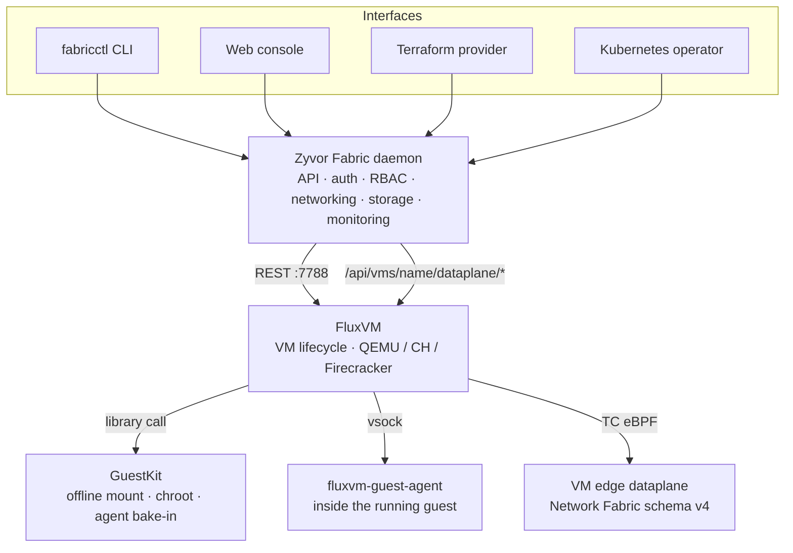

# Architecture: FluxVM + GuestKit

How Fabric composes the FluxVM engine and GuestKit disk tooling. The wider design is in [architecture.md](architecture.md). Back to the [README](../README.md).

## Architecture: FluxVM + GuestKit

Zyvor Fabric is a thin, opinionated layer. It doesn't own a hypervisor or a guest-filesystem library — it composes two sibling projects:

- **[FluxVM](https://github.com/zyvorai/fluxvm) — the VM engine.** `zyvor-fabricd` never touches QEMU directly. It talks to a local FluxVM instance over REST (`127.0.0.1:7788`) for VM process lifecycle, disks, console/VNC, cgroups, and per-VM network namespaces. Backends (QEMU, Cloud Hypervisor, Firecracker) are an FluxVM-side concern.
- **[GuestKit](https://github.com/zyvorai/guestkit) — guest-side tooling.** Before first boot, FluxVM uses GuestKit to reach inside disk images (NBD mount, chroot customize, bake in `fluxvm-guest-agent`) without a libguestfs appliance VM.

**Fabric decides what should exist; FluxVM makes it exist; GuestKit prepares the disk.**

Fabric puts **operator UX (API · Web · CLI)** on top of FluxVM's **TC/eBPF VM-edge dataplane**, so per-VM policy, rate limits, and telemetry are first-class — not afterthought scripts bolted onto a shared bridge. The full mechanics (kernel program flow, packet decision tree, control-plane sequence, and a head-to-head comparison against libvirt/nft, shared-bridge, QEMU usermode, and CNI microVMs) live in their own doc: **[Network Fabric architecture →](network-fabric-architecture.md)**.
