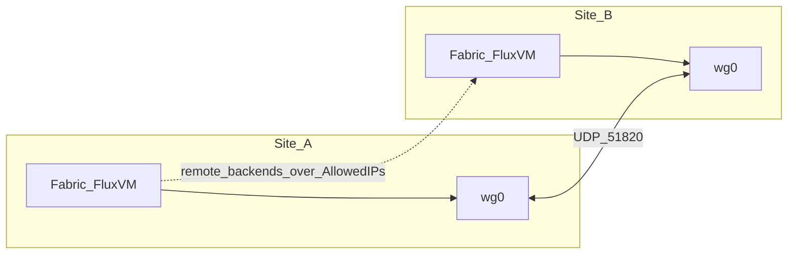

# Fabric ↔ FluxVM Service Fabric v6+

Fabric owns **distributed** service intent; FluxVM owns **node-local** TC/XDP
execution and maps. Fabric never invokes `bpftool`, `tc`, `ip`, or writes
`/sys/fs/bpf` (including Cilium private maps).

The **BPF ABI remains schema 4**. **v6** adds identity/L7 service policy and an
HA mutation queue around that ABI, with **program generation 6** on FluxVM.
v5 durable leases and sequence/ack HA deltas remain. **v6+** (Fabric) adds
minimal multi-site anycast fencing via optional `site_id` / `route_domain` on
service intent and edge leases (default domain when unset).

FluxVM reference: [service-fabric.md](https://github.com/zyvorai/fluxvm/blob/main/docs/service-fabric.md) ·
Boundary: [FLUXVM-FABRIC-BOUNDARY.md](FLUXVM-FABRIC-BOUNDARY.md) ·
Examples: [examples/service-fabric-v3/](examples/service-fabric-v3/) ·
FluxVM v6 examples: [service-fabric-v6](https://github.com/zyvorai/fluxvm/tree/main/examples/service-fabric-v6) ·
Shipped: [phase4](service-fabric-phase4.md) · [phase5](service-fabric-phase5.md) ·
[phase6](service-fabric-phase6.md).

## Fabric v6+ responsibilities

Everything from v5, plus:

- transactional multi-node **identity / L7 service policy** fan-out (snapshot +
  rollback on partial apply);
- optional **site/route-domain** fencing for anycast VIP advertise and
  site-scoped policy fan-out (minimal);
- **ClusterMesh-like identity directory (minimal)** — Fabric catalog +
  reconcile into FluxVM remote ipcache so cross-site `allow_identities` can
  resolve (see [phase6](service-fabric-phase6.md));
- **Full mesh datapath lifecycle v2 (remote backends)** — Fabric catalog +
  reconcile merges peer-site Ready and active Draining endpoints into Maglev
  service upserts (weighted drain handoff + optional VIP match; no
  Geneve/VXLAN/WireGuard-in-BPF tunnels; L3/anycast + remote backends; use
  Fabric VPN Mesh WireGuard as the encrypted underlay — see
  [WireGuard underlay](#wireguard-underlay-for-multi-site-service-fabric));
- proxy of FluxVM policy and Envoy contract endpoints;
- HA mutation-queue drain remains on FluxVM; Fabric still drives sequence/ack
  delta replication and full-snapshot fallback.

## Fabric REST (proxied)

| Method | Path | Role |
|--------|------|------|
| `GET/POST` | `/api/dataplane/services` | List / upsert Maglev service via `service-lb` |
| `GET/DELETE` | `/api/dataplane/services/{name}` | Get / delete |
| `GET` | `/api/dataplane/services/status` | Host service dataplane (`schema_version`) |
| `GET` | `/api/dataplane/services/stats` | Counters |
| `GET` | `/api/dataplane/services/health` | Backend health report |
| `POST` | `/api/dataplane/services/health/reconcile` | Run TCP probes |
| `POST` | `/api/dataplane/services/conntrack/gc` | Expire affinity / reverse NAT |
| `GET` | `/api/dataplane/services/advertisements` | VIP advertise snapshot |
| `GET` | `/api/dataplane/services/flows` | FluxScope service flows |
| `POST` | `/api/dataplane/services/telemetry/export` | OTLP/HTTP JSON export |
| `GET` | `/api/dataplane/services/{name}/conntrack/delta` | HA delta export |
| `POST` | `/api/dataplane/services/{name}/conntrack/delta/import` | Apply HA delta |
| `POST` | `/api/dataplane/services/{name}/conntrack/delta/ack` | Advance source watermark |
| `GET/POST` | `/api/dataplane/services/policies` | List / upsert identity+L7 policy |
| `GET/DELETE` | `/api/dataplane/services/{name}/policy` | Get / delete policy |
| `GET` | `/api/dataplane/services/{name}/l7/envoy` | Envoy redirect contract metadata |
| `GET/POST` | `/api/dataplane/remote-identities` | List / upsert remote identity directory |
| `POST` | `/api/dataplane/remote-identities/reconcile` | Fan directory → FluxVM remote ipcache |
| `DELETE` | `/api/dataplane/remote-identities/{route_domain}/{identity_id}` | Delete + unfan |
| `GET/POST` | `/api/dataplane/remote-backends` | List / upsert remote backend catalog (`vip?`, `drain_until_unix_ms?`) |
| `POST` | `/api/dataplane/remote-backends/reconcile` | Merge Ready + active Draining remotes → Maglev service upsert |
| `POST` | `/api/dataplane/remote-backends/{route_domain}/{service}/{address}/{port}/drain` | Weighted drain handoff (`drain_until_unix_ms?`, `weight?`) + reconcile |
| `DELETE` | `/api/dataplane/remote-backends/{route_domain}/{service}/{address}/{port}` | Delete all VIP rows for endpoint + re-reconcile |

Policy JSON uses `service`, `default_action`, `allow_identities` /
`deny_identities`, `audit_only`, optional `l7` (not `name` / `default`).

## CLI

```bash
zyvorctl dataplane service list
zyvorctl dataplane service apply --file docs/examples/service-fabric-v3/ha-draining-service.json
zyvorctl dataplane service status
zyvorctl dataplane service flows
zyvorctl dataplane service delta payments --after-seq 0
zyvorctl dataplane service delete payments
```

## Maglev DNAT and VM edge policy

On VM-edge ingress, Maglev selection + NAT rewrite runs in `fvm_svc_vm` **before**
the per-VM sandbox classifier. After a successful DNAT the service program returns
`TC_ACT_OK`, which **stops the TC clsact chain** — rewritten backend
address/port traffic is not re-filtered by VM `allow_ports`. Operators do **not**
need backend service ports in per-VM edge allowlists for Maglev-forwarded VIP flows.

## North-south prerequisites (FluxVM)

HA delta export/import/ack and VIP `advertisements` require FluxVM host-side service
TC to be pinned. Configure `[sandbox.dataplane.service] north_south_interfaces` on
each edge node (physical uplinks). Service specs must use `exposure` north-south or
both; north-south **NAT** also requires `snat_address` so backend replies return
through FluxVM. Fabric proxies these FluxVM endpoints unchanged; it does not attach
TC programs itself.

## WireGuard underlay for multi-site Service Fabric

WireGuard is **Fabric VPN Mesh** (Net Security → VPN), not a Maglev/eBPF tunnel.
FluxVM Service Fabric stays L3/anycast + remote backends; it does **not**
encapsulate in `fluxvm_service*.bpf.o` (no Geneve/VXLAN/WireGuard in BPF).

Use WireGuard as the **encrypted site-to-site underlay**. After peer
`AllowedIPs` make remote backend CIDRs reachable, publish those endpoints via
remote-backends / remote-identities and reconcile.



### Console

1. **Infrastructure → Net Security → VPN**
2. Create a tunnel or VPN network (`full_mesh` / `hub_spoke` / `point_to_point`), or
   **Sync** → **Adopt** an existing host `wg*` interface
3. Confirm `wg show` handshake/transfer; peer `AllowedIPs` cover backend ranges

See [network-security.md](user/pages/infrastructure/network-security.md).

### API (sketch)

```bash
# Point-to-point site link (keys via private_key_ref / peer public_key)
curl -sk -H "Authorization: Bearer $TOKEN" -H "Content-Type: application/json" \
  -d '{
    "name": "site-link",
    "interface_name": "wg0",
    "listen_port": 51820,
    "address": "10.10.0.1/24",
    "private_key_ref": "vault:wg/site-link",
    "peers": [{
      "public_key": "<peer-pubkey>",
      "endpoint": "<peer-public-ip>:51820",
      "allowed_ips": ["10.10.0.2/32", "10.88.0.0/16"],
      "persistent_keepalive": 25
    }]
  }' \
  "https://$FABRIC:9095/api/vpn-tunnels"
```

Host package: `wireguard-tools`. Broader VPN Mesh examples:
[networking.md](networking.md#vpn-mesh).

### After the tunnel is up

1. Tag Maglev services with `site_id` / `route_domain`.
2. `POST /api/dataplane/remote-backends` with peer addresses reachable over WG.
3. `POST /api/dataplane/remote-backends/reconcile` — Maglev merges Ready / active Draining remotes.
4. Optionally `POST /api/dataplane/remote-identities` + reconcile for cross-site policy IDs.

WireGuard does **not** replace Maglev, BGP anycast, or remote-backend reconcile; it
only encrypts and carries the L3 path those features assume.

Lab e2e (handshake, idempotent sync, remote-backends + remote-identities over
`AllowedIPs`): [`scripts/test-wireguard-service-fabric.sh`](../scripts/test-wireguard-service-fabric.sh).

Production readiness (read-only): [`scripts/test-production-readiness.sh`](../scripts/test-production-readiness.sh)
with `FABRIC_TOKEN` (opt-in mutate via `RUN_MUTATING=1`).

## Ownership reminder

| Plane | Owner |
|-------|--------|
| Service intent, leases, fan-out, BGP/ECMP, HA replication cursors, policy transactions, remote identity/backend catalogs | Fabric (`service-lb`) |
| WireGuard VPN Mesh (host overlays, peers, topologies) | Fabric (`vpn-mesh` / Net Security VPN) |
| TC/XDP programs, Maglev tables, fct/nat/edt/sflows, policy maps, HA queue, delta journal | FluxVM |
| Per-VM L3/L4 policy (Network Fabric schema v4) | FluxVM (orthogonal) |
| HTTP/gRPC parsing for L7 enforce | Envoy (eBPF only redirects) |
