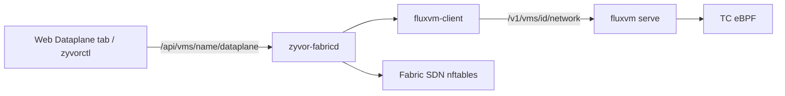
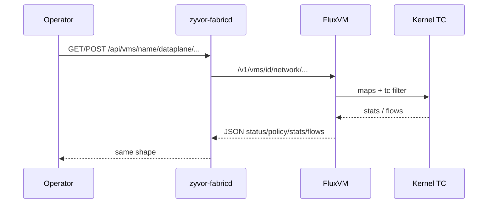

# FluxVM Network Fabric (VM edge dataplane)

Fabric proxies FluxVM's **Network Fabric v3** TC/eBPF per-VM edge dataplane. This is **not** the same as Fabric's `/api/network-policies` SDN (label selectors → host nftables).

| Layer | Owns | API |
| --- | --- | --- |
| Fabric SDN | Host-side isolation between VMs/workloads | `/api/network-policies` |
| FluxVM edge | Per-VM allowlists, Mbps/PPS, stats/flows on the TAP/netns | `/api/vms/{name}/dataplane/*` |





## Enable on the FluxVM side

Ship [`configs/fluxvm-dataplane.toml`](../../configs/fluxvm-dataplane.toml) (compose/k8s already mount it). Image must contain `/usr/lib/fluxvm/bpf/fluxvm_tc.bpf.o`. After first successful attach (`schema_version=3`, `attached=true`), set `required = true` for fail-closed production.

Kernel packet-path and TC decision diagrams: [FluxVM Network Fabric architecture](https://github.com/zyvorai/fluxvm#network-fabric-architecture-how-it-works).

## UX

VM detail → **Dataplane** tab (also linked from Network):

- **Status** — mode, attached, schema, policy synced
- **Policy** — default allow, CIDRs, ports, Mbps/PPS, sample rate (presets + JSON)
- **Stats** — allow/drop counters
- **Flows** — sampled flow table with limit / auto-refresh

## Lab verify via Fabric

Against a Fabric + FluxVM stack with `mode=ebpf`:

```bash
# Bridged VM (driver already requests Tap.netns=true)
zyvorctl create lab-dp --image /var/lib/fluxvm/images/ubuntu.qcow2
zyvorctl start lab-dp

zyvorctl dataplane status lab-dp
# expect mode=ebpf, attached=true, schema_version=3

cat > /tmp/dp-policy.json <<'EOF'
{
  "default_allow": true,
  "allow_cidrs": ["0.0.0.0/0", "::/0"],
  "allow_ports": ["80", "443"],
  "max_egress_mbps": 100,
  "max_egress_pps": 10000,
  "sample_rate": 1
}
EOF
zyvorctl dataplane policy set lab-dp --file /tmp/dp-policy.json
zyvorctl dataplane stats lab-dp
zyvorctl dataplane flows lab-dp --limit 20

# Fabric SDN still independent
curl -s http://127.0.0.1:9095/api/network-policies | head
```

Or via REST: `GET/POST http://127.0.0.1:9095/api/vms/lab-dp/dataplane/...` (same auth as other VM ops).
