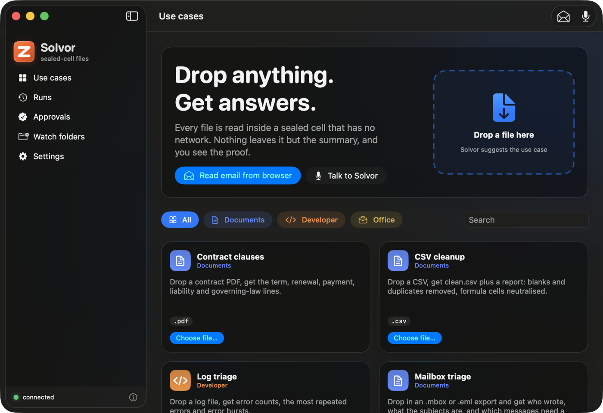
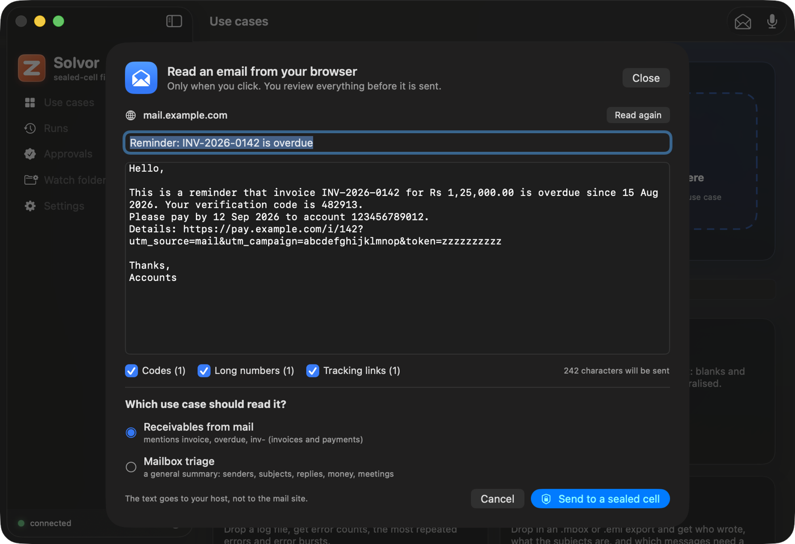
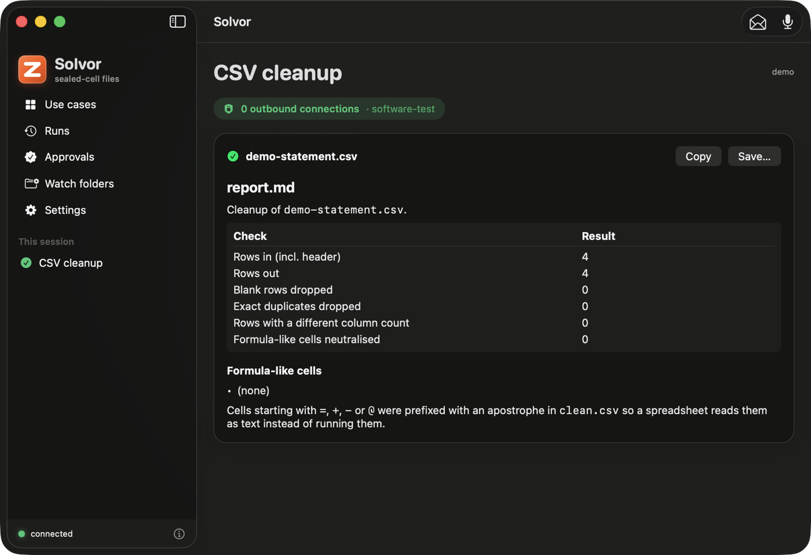

# Solvor

Solvor is a native macOS app (SwiftUI, Liquid Glass on macOS 26, system accent colour on older releases) for using Keep from a Mac. Source: [`integrations/macos-keep`](https://github.com/zyvorai/fabric/tree/main/integrations/macos-keep).

**What it is.** A client. You choose or drop a file; the app uploads it to a Keep host you run; the host reads it in a sealed cell that has
no network; the summary comes back and is kept in a history. Every use case the host lists is available: the built-ins, the
[scenario packs](SCENARIOS.md) and your own.

**What it is not.** It does not run commands on your Mac (the "how to get this file" command is shown so you run it yourself), does not drive other
apps (no AppleScript or Accessibility automation), and is not an agent that operates the desktop: a Keep cell is a Linux microVM. It is
also not a signed, notarized release; it builds locally with ad-hoc signing.

## What it does

| Area | What you get | State |
|---|---|---|
| Connect | Host and user token (Keychain, this device only); `GET /v1/keep/status`, `/v1/demos`, `/v1/usage` | Used against a real host |
| Use cases | Searchable cards from the live list, grouped (Documents, Phone, Mac, Windows, Developer, Browser, Office); accepted file types; a copyable "how to get this file" command | Used against a real host |
| Run | Drop files on a card or the window, or choose them; a suggested use case from the file type; several files run as one batch (one cell each, HTTP 207 handled) | Client tested against real cells; drop UI not exercised |
| Result | Markdown summary with tables; "0 outbound connections", the evidence class and the operator-can-read line; Copy and Save | Rendering unit-tested; result view not exercised |
| Runs | History from `GET /v1/artifacts`, open a run, compare two (`/diff`) | Client tested against a real host; UI not exercised |
| Approvals | Pending approvals; approve or deny with a signature made in the Secure Enclave over the exact `keep-approval-v1` text; a Developer-mode enrolment with an operator token that is never stored | Signing checked against the runtime's test vectors; not run against a waiting approval on a host |
| Watch folders | A rule (folder, patterns, use case) runs new files once (content-hashed) and can save `name.keep.md` next to the file | **Verified end to end**: a file dropped in a watched folder ran in a real cell and its summary was written beside it |
| Read an email from the browser | **Only on your click**: reads the front tab of Safari, Chrome, Brave, Edge or Arc (Firefox has no scripting interface) through Apple Events: the selected text if there is a selection, else the message area. A preview lets you edit the text and switch redaction off or on (one-time codes, long account and card numbers, tracking parameters), suggests the matching mail use case, then sends it to a sealed cell as an `.eml` | Page-to-`.eml` pipeline and the routed packs **verified in real cells**; the browser reading needs your Automation permission and the browser's "Allow JavaScript from Apple Events", so it is **not verified against a real webmail page** |
| Talk to Solvor | Microphone button: Speech transcribes in the language you pick, Apple's on-device Translation turns it into English, a fixed set of commands is recognised (read the browser email, summarise a file or your latest download, show runs, approvals, watch folders). It shows "I heard, I will" and waits for a click | Command parser unit-tested; microphone, Speech and Translation need your permissions and were **not run here** |
| Menu bar | Drop zone, recent runs, waiting approvals, run the clipboard as a text use case | Built; not exercised |
| Services | "Send to Keep" in Finder's Services menu (an `NSServices` entry, no extension target) | In Info.plist; not exercised |
| Shortcuts and Siri | App Shortcuts ("Read my email with Solvor", "Summarise my latest download with Solvor", "Show my approvals in Solvor") so Siri and Shortcuts can start the same actions. Siri matches phrases the app registered; it does not translate | Built; **not verified**: Siri and the Shortcuts registration were not run here |
| `keep://run?usecase=…&path=…` | Starts a run from a link | In Info.plist; LaunchServices did not bind the scheme for a build run from a temporary folder, so **unverified** |

## Safety

- Email is **untrusted data**. Reading happens only when you click; the preview always appears before anything is sent; the text goes to your Keep host,
  never to the mail site; Solvor never sends, replies, deletes or clicks anything in your mail and never touches mail credentials. Keep's packs are
  extractive (no model), so an email cannot give the summary an instruction.
- **Voice can never approve or deny.** Approvals need Touch ID. Voice, Siri and Shortcuts cannot send, delete or approve, and a file is only offered
  after it is shown to you and passes the same secret scan and size check as a click.

- Before an upload the app scans the file's name and its first 512 KB for private keys, cloud and token strings and `.env`-style files, and
  asks before sending; it never echoes a secret. Files over a size you choose also ask.
- The token is sent only in the `Authorization` header (the runtime refuses a user token in a URL). The operator token is used only in
  Developer-mode enrolment, once, and is not stored.
- Uploads go to the host you configured. The evidence class is `software-test`: whoever operates the host could still read a cell's memory.
  The app says so in Settings and on every result.

## Screens

| Read an email | Talk to Solvor | A result |
|---|---|---|
|  |  |  |

Screenshots are of the window only, from a debug build against a lab host, with a made-up email.

## How it maps to the API

`GET /v1/keep/status`, `GET /v1/demos`, `POST /v1/demos/{id}` (multipart, repeated `file` fields for a batch), `GET /v1/artifacts`,
`GET /v1/artifacts/{id}`, `GET /v1/artifacts/{a}/diff/{b}`, `GET /v1/inbox`, `GET /v1/approvals`, `POST /v1/approvals/{id}`
(`decision`, `device_id`, `signature`), `POST /v1/users/{id}/devices` (operator only), `GET /v1/usage`. The signed text is
[documented here](mobile/README.md) and pinned by `docs/keep/mobile/test-vectors.json`.

## Limits and next steps

No Share-sheet extension (it needs a signed extension target), no notarized build or dmg, no push relay (approvals are polled every 20 s
while the app runs), and the hooks marked "not verified" above still need a run on a Mac with the app installed in `/Applications`. See
[RECIPES.md](RECIPES.md) for calling Keep from Shortcuts, scripts and other agents without this app.
