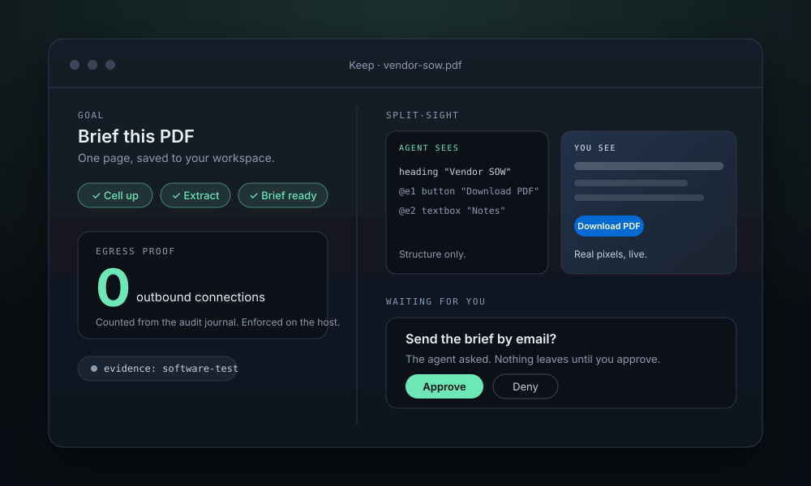
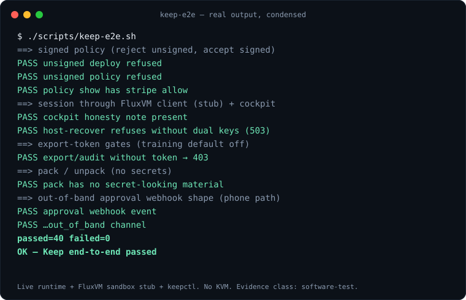
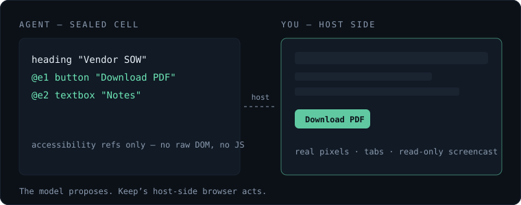
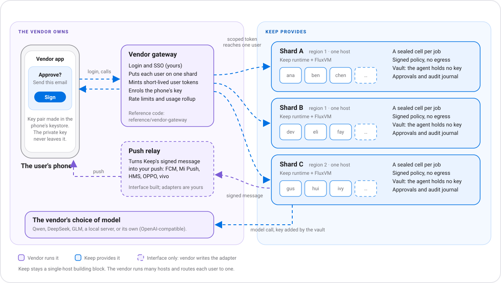

<div align="center">



# Keep

**Your agent gets a real computer. You keep the keys.**

Keep gives an untrusted AI agent its own sealed computer on hardware you control,
while you hold the policy, the credentials and the approvals. Open source, Apache-2.0.

[](../../.github/workflows/keep.yml)
[](../../LICENSE)


[**Try it in 60 seconds**](#try-it-in-60-seconds) ·
[How it works](#how-keep-works) ·
[Keep vs Muse](#keep-vs-meta-muse) ·
[Docs](KEEP.md) ·
[Website](https://zyvorai.github.io/fabric/keep)

</div>

<p align="center">
  
</p>

<p align="center"><sub>Real output of <code>./scripts/keep-e2e.sh</code>, condensed. Record your own GIF with <code>./scripts/keep-record-demo.sh</code>.</sub></p>

## Contents

- [Why Keep](#why-keep)
- [How Keep works](#how-keep-works)
- [Try it in 60 seconds](#try-it-in-60-seconds)
- [One-click use cases and ready-made agents](#one-click-use-cases-and-ready-made-agents)
- [Build your own use case](#build-your-own-use-case)
- [Install it on a host](#install-it-on-a-host)
- [Security profiles and what we do not claim](#security-profiles-and-what-we-do-not-claim)
- [Keep vs Meta Muse](#keep-vs-meta-muse)
- [Where everything lives](#where-everything-lives)
- [FAQ](#faq)

## Why Keep

| | |
|---|---|
| **You run it** | A laptop, a mini-PC or your own FluxVM host. Same API everywhere. |
| **You read it** | Policy is a signed `keep.policy.yaml` you can diff in git. |
| **You take it with you** | `keepctl pack` writes your policy, agent manifest and migration notes to a folder. `keepctl unpack` restores them on another FluxVM node. Secrets are not included. |

Keep starts from one assumption: **the model is compromised the moment it reads a webpage.**
So the agent never holds real passwords, never approves its own actions, and never decides its own network rules.

## How Keep works

Keep has three domains, and the line between them is the whole design. The **agent cell** is the only untrusted party. Everything with authority (policy, secrets, network rules, durable state) sits on the host side of the line.

```text
You (phone or laptop)
  |   policy, approvals
  v
+---------------------------------------------------------------+
| HOST: Linux + KVM, a FluxVM node you control                  |
|                                                               |
|  Sentinel   signed policy, sole egress and connector          |
|             authority, network rules enforced on the host     |
|  Vault      secrets stay on the host, injected only at        |
|             approved exits                                    |
|  Supervisor starts, freezes and tears down cells              |
|                                                               |
|   +-------------------------------------------------------+   |
|   | AGENT CELL: Firecracker/KVM microVM (untrusted)       |   |
|   |   agent runtime, tools, workspace                     |   |
|   |   no raw secrets, no host files, no network control   |   |
|   |   brokered Chromium: accessibility tree only          |   |
|   +-------------------------------------------------------+   |
|                                                               |
|  durable state (database, audit journal) lives on the host    |
+---------------------------------------------------------------+
```

Keep is a product layer of [Fabric](../../README.md) on the [agent runtime](../../agent-runtime/) and [FluxVM](https://github.com/zyvorai/fluxvm). It is not a second hypervisor and not a separate repository.

### The cell

The untrusted agent runtime runs in a **microVM on FluxVM**, not only in a container on the host kernel. If something inside goes wrong, an escape has to get through a hypervisor before it reaches the vault.

- No raw secrets, no host filesystem, no ability to change its own network rules.
- The admin plane is **vsock only**. There is no SSH to the agent.
- An optional `ttl_seconds` gives you throwaway research cells.

More: [cell/README.md](cell/README.md).

### Sentinel: policy you can diff

The agent never decides what it may do. Sentinel does, from a policy file:

```yaml
version: 1
default_egress: deny
allow:
  - { host: api.stripe.com, methods: [POST], action: checkout, ask: always }
  - { host: api.github.com, methods: [GET],  action: read,     ask: first }
deny:
  - { host: "*.onion" }
taint:
  on_untrusted_page: block_egress_until_ask
```

- **Deny by default.** Anything not listed is refused.
- **Ask levels** per rule: `always`, `first` or `never`.
- **Taint.** After the agent reads an untrusted page, egress is blocked until you approve, and the cockpit paints the process red.
- **Signed.** In Keep mode (`ZYVOR_AGENT_KEEP_MODE=1`) the runtime refuses to start without `ZYVOR_AGENT_POLICY_TRUSTED_SIGNERS`, and every policy update must carry an Ed25519 signature over the exact YAML bytes. Unsigned policy does not load.

More: [sentinel/README.md](sentinel/README.md).

### Vault: the agent never holds the password

Real credentials live in the vault on the host. The egress broker injects a secret **after** the allowlist check, so it never appears in a tool result or in the model's context. A secret is released only when the request matches the whole descriptor: credential, host, method, path, port and user. For TLS hosts a surrogate token (`zy_sur_…`) can stand in and is swapped for the real secret only at the approved exit. Password fill in the browser is done by the host and never returned to the model.

> **Honest limit.** Today the secret material lives in the **host process environment**, so the operator of the host can read it. The vault protects secrets from the agent, not from the host's operator. Sealing secrets to a key only you hold is a hardware-gated goal (see [KEEP-0.2.md](KEEP-0.2.md)).

More: [vault/README.md](vault/README.md).

### Host confinement: rules the agent cannot argue with

The agent does not police its own network. Keep posts a strict policy to FluxVM, and the **host** enforces it on the sandbox's network interface with TC/eBPF, never inside the guest.

| Field | What Keep sets |
|---|---|
| `default_allow` | `false`: deny by default |
| `allow_cidrs` | The gateway only |
| `allow_ports` | The broker and an optional CONNECT proxy |
| `deny_udp` | `true`: shuts off QUIC, WebRTC and STUN (DHCP still allowed) |
| `deny_cidrs` | The cloud metadata address and public recursive DNS |

If a connection slips through, the session is **frozen** (`agent_paused_reason: ebpf_deny`). The proof surfaces are the audit journal (`egress.connect`, `ebpf.*`), the cockpit's `egress_connects` counter, and FluxVM drop reasons such as `udp-deny` when the dataplane is attached. PacketWolf and netevd are optional observers, not requirements.

More: [confine.md](confine.md).

### Approvals: out of band

Buying, sending, deleting and new logins never confirm inside the chat. Approval arrives on a channel the guest cannot see (a phone push or a webhook to `/v1/approvals`), and the capability token is bound to a **connector and an action**, not to a free-form sentence. More: [approve/README.md](approve/README.md).

### Brokered browser: structure for the agent, pixels for you

When the agent needs the web, a brokered Chromium does the browsing. The agent works from an **accessibility outline** (`heading "Vendor SOW"`, `@e1 button "Download PDF"`); you watch the real pixels with a tab listing, a screenshot and a read-only screencast. Only the listing endpoints are exposed; there is no mutating DevTools access. More: [browser/README.md](browser/README.md).

<p align="center">
  
</p>

### Cockpit

The console shows a session as a chain: goal, current task, egress proof, honesty badge, browser, pending approvals and outcome. The same data is a plain API (`GET /v1/sessions/{id}/cockpit`) and a minimal HTML page for a phone (`/keep/cockpit`). More: [cockpit/README.md](cockpit/README.md).

### A PDF brief, step by step

1. **Drop in a PDF.** Keep starts a fresh cell for the job.
2. **The agent works inside.** It extracts text in its cell. No browser, nothing sent out.
3. **The host guards the door.** Only the gateway is reachable; UDP, cloud metadata and public DNS are blocked.
4. **You get the brief.** One page in your workspace; anything risky waits for your approval.

The cockpit reports `egress_connects` from Keep's own audit journal, and the demos expect it to read `0`. The built-in demos are **extractive**: they pull text out and summarise it by rule, and they do not call a model, which is why zero is an honest number. Walkthrough: [Tutorial 17](../tutorials/17-keep-pdf-brief.md).

## Try it in 60 seconds

**See what the use cases give you, on this laptop, with no KVM, Docker or root** (a macOS or Linux machine with Python, Node 20 and Rust):

```bash
git clone https://github.com/zyvorai/fabric && cd fabric
./scripts/keep-demo-local.sh            # prints a token and a first command; Ctrl-C stops it and deletes its state
```

**This is a simulator, not a sealed cell.** There is no VM and no network policy: the fixed extractors run as ordinary processes on your machine, so nothing
is isolated and the connection count means nothing. Every result says `SIMULATED, not sealed` (evidence class `simulated`), and Solvor and the console show that
instead of the proof. It is only for looking at the output of a use case before you set up a host. For a real cell use [`scripts/keep-up.sh`](#install-it-on-a-host)
on Linux with KVM. Do not feed the simulator files you would not run a script on.

**Or the developer path.** No KVM needed for the first two steps.

```bash
git clone https://github.com/zyvorai/fabric && cd fabric

# 1. Unit tests for the runtime (Sentinel, vault, egress, approvals)
cargo test --manifest-path agent-runtime/Cargo.toml --lib

# 2. End to end: live runtime + FluxVM sandbox stub + keepctl
./scripts/keep-e2e.sh          # ends with: passed=40 failed=0

# 3. On a FluxVM host with a node22-agent template (./scripts/keep-bake-node22-agent.sh builds it)
./scripts/keep-live-lab.sh
```

`keepctl` in ten lines:

```bash
export KEEP_API=http://127.0.0.1:9096
export KEEP_TOKEN=…                      # ZYVOR_AGENT_API_TOKEN

keepctl create -f deploy.json            # deploy an agent
keepctl policy show my-agent
keepctl policy set my-agent keep.policy.yaml keep.policy.yaml.sig
keepctl cockpit <session-uuid>
keepctl pack   ./keep-pack my-agent      # leave: policy, manifest, notes (no secrets)
keepctl unpack ./keep-pack my-agent      # arrive on another FluxVM node
```

Then stage the demo: [Tutorial 17 — drop in a PDF, get a brief, with zero outbound connections](../tutorials/17-keep-pdf-brief.md). Full CLI: [keepctl/README.md](keepctl/README.md).

## One-click use cases and ready-made agents

Seven use cases ship built in. Each takes a file and returns an artifact, needs no browser, and expects `egress_connects: 0`. Run one from the console (`/app/keep`) or with `keep-demo.sh <id>`. See [demos/README.md](demos/README.md).

| Use case | You drop in | You get |
|---|---|---|
| `pdf-brief` | a PDF | `brief.md` |
| `contract-clauses` | a contract PDF | `clauses.md` |
| `security-questionnaire` | a questionnaire PDF | `answers.md` |
| `meeting-actions` | a `.txt` or `.vtt` transcript | `actions.md` |
| `log-triage` | a `.log` or `.txt` file | `triage.md` |
| `sbom-summary` | CycloneDX, SPDX or SARIF JSON | `summary.md` |
| `csv-clean` | a `.csv` | `clean.csv` and `report.md` |

Also packaged in [`examples/keep-agents/`](../../examples/keep-agents/): `browser-research` (allowlisted browsing to a research note), `infra-ops` (alerts, VMs and lifecycle, with remediation behind an approval), `migration-op` and `deploy-op`.

## Build your own use case

A **pack** is a directory with a single `pack.json`. Three kinds:

| `kind` | What it is | Deploy with |
|---|---|---|
| `usecase` | A declarative use case: an extractor and a few summary rules. **No code.** | The console form, or `keepctl deploy <dir>` |
| `agent` | A TypeScript agent that runs **inside the cell**, with a manifest and an optional signed policy | `keepctl deploy <dir>`, or `keepctl bundle` and then the console's **Deploy a pack** |
| `builtin` | Documents a use case the runtime already ships. Nothing to deploy. | `keepctl deploy <dir> --test` runs it |

The extractor is a fixed list (`pdftotext` or `text`), never a command. Reference: [PACKS.md](PACKS.md). Walkthrough: [Tutorial 19 — build your own use case](../tutorials/19-build-your-own-use-case.md). A worked example: [Tutorial 20 — a digest of a mail export](../tutorials/20-sort-a-mail-export.md) (no code, no model).

## Install it on a host

**On the Linux host itself** (KVM, systemd, x86_64, 4 GiB RAM, 20 GiB disk; Rust and Node 20+ installed):

```bash
sudo ./scripts/keep-up.sh --dry-run    # checks the machine and prints the plan; changes nothing
sudo ./scripts/keep-up.sh              # FluxVM already installed: runtime, cell template, then a Solvor token
sudo ./scripts/keep-up.sh --install-fluxvm   # also builds FluxVM from source (experimental, see below)
```

It ends by printing the exact [Solvor](https://github.com/zyvorai/solvor) settings and a 7-day user token (not the operator token, not saved to disk).
The preflight refuses a machine without `/dev/kvm` rather than pretend a cell is sealed. **Verified:** the checks, `--dry-run` and the token
step (fake facts, `agent-runtime/tests/keep-up.sh`), and the runtime and template steps it reuses (they are what the lab host runs). **Not yet verified:**
a run on a clean machine from nothing, and `--install-fluxvm`, which follows FluxVM's Quick start but has not been run end to end.

**From your laptop, over ssh:**

```bash
./scripts/deploy keep user@host     # needs FluxVM on the host
keepctl doctor                       # checks the install
```

Keep mode is **fail-closed**: it requires trusted policy signers at startup, refuses unsigned policy updates, and requires a signature over each agent deployment. The production checklist is in [PRODUCTION.md](PRODUCTION.md).

## Security profiles and what we do not claim

Keep runs on FluxVM's security profiles:

| Profile | Evidence class | Hardware attestation |
|---|---|---|
| `standard` | none | no |
| `measured` | `software-test` | **never** |
| `confidential-snp` / `confidential-tdx` | `sev-snp` / `tdx`, only after a verified hardware run | gated |

> [!IMPORTANT]
> **The quiet part.** Keep runs on measured VMs today, and its evidence class is `software-test`.
> Until it runs on verified confidential hardware with a key only you hold (Keep 0.2),
> **the host can still see inside the VM.** We will not claim otherwise. The cockpit shows an
> honesty badge, and the UI must never say "the operator cannot read this" while the class is `software-test`.

## Keep vs Meta Muse

Muse got the threat model right. Keep is the version you run, read and take with you. The Muse-side details below come from Meta's own announcement (first source under the table) and public reporting, and may change.

| | Meta Muse | Keep |
|---|---|---|
| Where it runs | Meta's cloud only; not self-hostable. | Your hardware, under Apache-2.0. |
| The cell | Its own dedicated cloud VM; a separate Sentinel runs on the same machine, kept apart from the agent at the system level. Meta's announcement does not describe how the agent is separated inside that VM. | A Firecracker/KVM microVM per cell on FluxVM, with its own kernel; the network policy is applied by the host, outside the guest. |
| Model | Muse Spark, Meta's proprietary model. | Bring your own model socket. |
| Training data | Users can opt out of interaction data being used for training. | Off by default. Export needs a scoped token. |
| Policy | Set by Meta. | A signed `keep.policy.yaml` you can diff in git. |
| Secrets | Credentials injected at the network boundary. | The same idea: the vault injects on the host, and the agent never sees a real secret. |
| Browser | An accessibility-tree browser agent. | The same idea: the agent sees structure, you see pixels. |
| Operator access | Governed by Meta's operational policies, not cryptography. | The same limit today, stated up front (see above). |

Full matrix: [homepage matrix](https://zyvorai.github.io/fabric/?t=stack#matrix). Longer read: [Keep vs Meta Muse](https://zyvor.dev/blog/keep-vs-meta-muse).

**Keep and personal-agent apps.** Apps offer chat clients, connectors and durable tasks; Keep is the sealed runtime under such an app: a microVM, a host-enforced deny-all
network policy and device-signed approvals. They fit together more than they compete; see [Keep and personal-agent apps](KEEP-AND-AGENT-APPS.md), including where Keep is behind today.

Sources for the Muse column: [Meta, "Introducing Muse", 2026-09](https://about.fb.com/news/2026/09/introducing-muse-personal-ai-agent/) (the VM, Sentinel, launch platforms iOS, Android and web plus WhatsApp, and the announced Confidential VM) · [MarkTechPost, 2026-09-08](https://www.marktechpost.com/2026/09/08/meta-introduces-muse-a-personal-ai-agent-that-runs-on-its-own-dedicated-secure-cloud-computer/) · [Vellum, "Official Muse Breakdown"](https://www.vellum.ai/blog/official-muse-breakdown) · [DEV Community, "Meta Muse and the Secure VM Bet"](https://dev.to/ifynx_studio/meta-muse-and-the-secure-vm-bet-personal-agents-that-act-without-owning-your-secrets-1ik4). Zyvor is not affiliated with Meta; if a Muse row is out of date, please open an issue.

## Where everything lives

| Path | What is there |
|---|---|
| [`agent-runtime/`](../../agent-runtime/) | The Rust runtime: Sentinel, vault, egress broker, approvals, browser, goals and the cockpit API |
| [`scripts/keepctl`](../../scripts/keepctl) | The CLI |
| [`scripts/keep-e2e.sh`](../../scripts/keep-e2e.sh) · [`keep-live-lab.sh`](../../scripts/keep-live-lab.sh) · [`keep-pilot-gate.sh`](../../scripts/keep-pilot-gate.sh) | End-to-end checks: stub, live lab and pilot gate |
| [`examples/keep-agents/`](../../examples/keep-agents/) | The packaged use cases and agents |
| `docs/keep/` | This documentation tree (spec, sentinel, vault, approvals, cell, browser, cockpit, demos, packs) |
| `web/src/pages/KeepHome.tsx` · `KeepSession.tsx` | The console: `/app/keep` and `/app/keep/:sessionId` |
| [`.github/workflows/keep.yml`](../../.github/workflows/keep.yml) | CI: unit tests, the seven demos end to end, a custom use case, a signed pack deploy, and the stub e2e |
| [`pilot-runs/`](pilot-runs/) | Archived live-gate runs on a FluxVM host |

## FAQ

**Does Keep need a model?** No. The built-in demos call no model at all. A use case you write can opt in to one host-side model step (a hosted API, a local model or your own service) that needs the vault to allow the endpoint and your approval on first use: see [MODEL.md](MODEL.md).

**Can I try it without KVM?** Yes. Steps 1 and 2 of [Try it](#try-it-in-60-seconds) run against a FluxVM stand-in. A real cell needs a FluxVM host.

**Is Keep a hypervisor?** No. FluxVM is the VM engine; Keep is Fabric's agent runtime plus a FluxVM cell.

**What does `software-test` mean?** Keep runs on measured VMs with software-level evidence. It is not confidential computing, and it does not stop the host's operator from seeing inside the VM. See [the limits above](#security-profiles-and-what-we-do-not-claim).

**Can I leave?** Yes. `keepctl pack` and `keepctl unpack` move your policy and agent to another FluxVM node. Secrets stay in the vault and are not exported.

## For phone makers

An Android maker (or anyone with a phone and an account system) can offer users a personal agent: a sealed Keep cell
per job in the vendor's cloud, approvals that only the user's enrolled phone key can sign, and the vendor's choice of
model. Keep is the building block; the vendor runs the accounts, the gateway, the push relay and the shards.



Start with [VENDORS.md](VENDORS.md); it lists what is built, what is reference code and what is not built.

## Where to go next

- [KEEP.md](KEEP.md) — the full spec, architecture and security profiles
- [Tutorial 16 — Keep workstation](../tutorials/16-keep-workstation.md) · [17 — PDF brief](../tutorials/17-keep-pdf-brief.md) · [18 — use cases](../tutorials/18-keep-use-cases.md) · [19 — your own use case](../tutorials/19-build-your-own-use-case.md)
- [MACOS-APP.md](MACOS-APP.md) — Solvor, the native Mac client for Keep
- [RECIPES.md](RECIPES.md) — calling Keep from Siri Shortcuts, macOS, Windows and other agents
- [VENDORS.md](VENDORS.md) — offering Keep to many users, as a phone vendor might · [picture version](https://zyvorai.github.io/fabric/keep/phones)
- [PRODUCTION.md](PRODUCTION.md) — production checklist · [STATUS.md](STATUS.md) — what ships today
- [Fabric](../../README.md) — the control plane Keep runs on

License: Apache-2.0.
