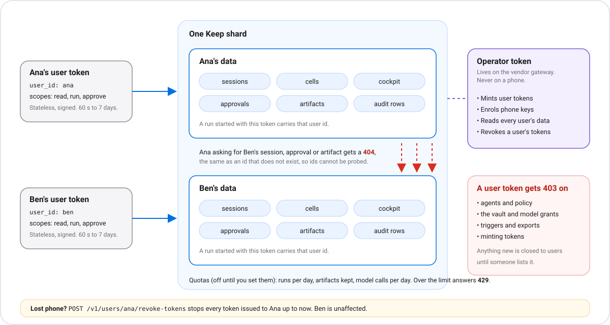

# Many users on one Keep

The runtime started as one operator's tool: one bearer token that can do everything. To serve many people (a
phone vendor's agent service, a team), the layer above hands each person a **user token** that reaches only that
person's data. Keep stays a single-host building block; you run many hosts and route each user to one
([VENDORS.md](VENDORS.md)).



## User tokens

The operator mints one per user:

```bash
curl -X POST $KEEP_API/v1/user-tokens -H "Authorization: Bearer $OPERATOR_TOKEN" \
  -H 'content-type: application/json' \
  -d '{"user_id":"ana","scopes":["read","run","approve"],"ttl_seconds":3600}'
```

| Field | Meaning |
|---|---|
| `user_id` | One user, `[a-z0-9._-]`, up to 32 characters. Every session the token starts belongs to them |
| `scopes` | `read` (list and read own things), `run` (start use cases and sessions, steer, cancel), `approve` (decide own approvals). Default: all three |
| `ttl_seconds` | 60 to 7 days, default 1 hour |

The token is stateless (HMAC-signed), so any shard with the same secret accepts it. The key is derived from the
operator token, or set explicitly with `ZYVOR_AGENT_USER_TOKEN_SECRET` (16+ characters), which is what you want when
several shards should accept each other's tokens. Send it as `Authorization: Bearer kut1.…`. **A token in a URL
query string is refused.**

## What a user token can reach

Only: their own sessions (and everything under them: events, cockpit, browser view, steering), their own approvals
(list and decide), their own artifacts (list, read, diff), their own slice of the audit journal, `GET /v1/demos`
and `POST /v1/demos/{id}` (a run is stamped with their id), `GET /v1/usage` and `GET /v1/inbox`, their own conversation
threads (`/v1/threads`: list, create, read, page messages, forget; see [threads](threads/README.md)), their own opt-in [memory](memory/README.md) (`/v1/memory`), and their own [goals](goals/README.md) (`/v1/goals`: create for themselves, read, cancel or pause, ask for a plan and accept or reject the proposed one; not `advance`).

Everything else is **403** by default, including agents, policy, the vault, triggers, model grants, exports, MCP and
minting tokens. A new operator route is closed to users until someone lists it in `authz::user_route`.

Another user's session, approval or artifact is **404**, the same as one that does not exist, so ids cannot be
probed. An artifact made outside any session belongs to nobody, so users never see it.

## Quotas and usage

Off by default. Set any of these on the runtime and a user over the limit gets **429**:

| Variable | Limit |
|---|---|
| `ZYVOR_AGENT_USER_MAX_RUNS_PER_DAY` | sessions (each use-case run is one) started in the last 24 hours |
| `ZYVOR_AGENT_USER_MAX_ARTIFACTS` | artifacts kept |
| `ZYVOR_AGENT_USER_MAX_MODEL_CALLS_PER_DAY` | model-step calls in the last 24 hours |

`GET /v1/usage?user_id=ana&since=…` (operator) or `GET /v1/usage` (user) reports runs, artifacts, bytes, model calls
and session-seconds. It is computed from records the runtime already keeps, so it is the number a vendor meters
and bills from. `session_seconds` is approximate: a running cell counts to its last update.

## Revoking

`POST /v1/users/{id}/revoke-tokens` (operator) makes every token issued to that user up to now stop working, for
example when a phone is lost. Tokens minted more than a second later work again. Other users are unaffected.

## Through fabricd

fabricd already scopes agents and sessions by the login's `tenant` and `sub`. It now also filters `/api/approvals`
(list and decide) and the audit journal by session ownership for non-admins; `/api/audit/agent-actions` needs a
`session_id` you own. `POST /api/agent-tokens` turns a logged-in user's JWT into a runtime user token for **their own**
id, for a client that talks to the runtime directly.

## Test it on a real host

`scripts/keep-live-tenancy.sh` runs two users in real cells against a live shard: isolation, a phone-signed approval
(with forged and flipped decisions refused), revocation, and with `--gateway` a vendor login through the reference
gateway. It needs the operator token and the `node22-agent` template.

```bash
export KEEP_API=http://127.0.0.1:9096 KEEP_TOKEN=<operator token>
./scripts/keep-live-tenancy.sh --gateway
```

## What this does not do

- **The operator token is still all-powerful**, and the runtime trusts whoever holds it. Keep it on your gateway,
  never on a phone.
- **The audit chain is one chain.** A user sees only their own rows and whether the chain is intact, not how long it is,
  but the rows sit in a shared file on the shard.
- **The vault is one per shard**: secrets come from the host environment and are shared by every user of that shard.
  `allowed_users` on a credential limits who may use it; there is no per-user secret store.
- **Approvals still trust the token.** A user token that has the `approve` scope can decide that user's approvals.
  Requiring the approval to be signed by the user's enrolled phone key is available: see [mobile/README.md](mobile/README.md).
- **No per-user identity check.** The runtime believes the `user_id` the operator put in a token.
