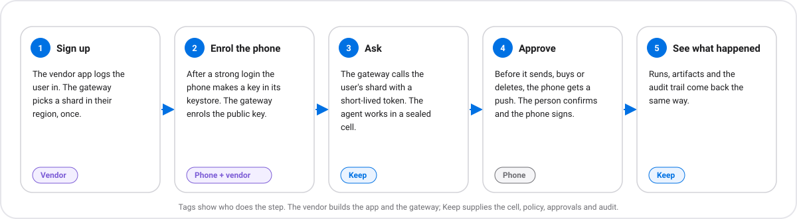
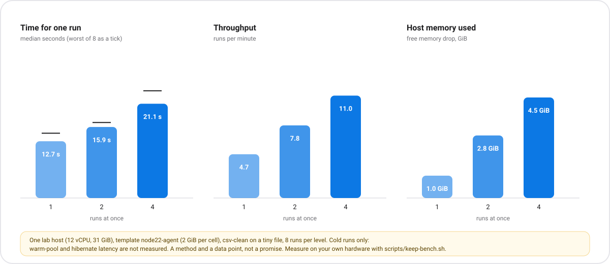

# Keep for a phone vendor

How an Android maker, or any company with a phone and an account system, offers its users a personal agent that
runs on a **cloud computer of its own** while the **phone holds the keys**. This is the shape Meta's Muse
describes; Keep is the version the vendor runs, reads and can take apart.

This page is a blueprint and a list of what exists. It is honest about what does not. Read
[the limits](#what-you-can-and-cannot-claim) before you promise anything to a user.

## Start here

Read in this order: this page (the blueprint and the limits), then [TENANCY.md](TENANCY.md) (many users on one
shard), then [mobile/README.md](mobile/README.md) (the phone side), then the
[reference gateway](https://github.com/zyvorai/fabric/tree/main/reference/vendor-gateway) and [MODELS.md](MODELS.md). A picture version of this
page is on the [Keep for phone makers](https://zyvorai.github.io/fabric/keep/phones) site page.

## The shape

A **shard** is one Keep host. Keep stays a single-host building block; the vendor runs many and puts a router in
front, so nothing here needs a distributed scheduler. Purple is the vendor's, blue is Keep's, dashed boxes are
interfaces Keep defines and the vendor implements.

| The vendor owns | Keep provides |
|---|---|
| User accounts and login, and step-up (biometric, second factor) | A sealed cell per job, on hardware you control |
| Which shard a user lives on, and in which region | Signed policy, deny-by-default egress, taint rules |
| Push delivery to phones (its own push channels) | Approvals that only an enrolled phone key can sign |
| Billing, metering, quotas policy | Per-user isolation, quotas and a usage report |
| The app and its UI | A vault: the agent never holds an API key |
| Which model answers | Any OpenAI-compatible endpoint, gated by the vault |
| Hosts, regions, capacity | An audit journal per shard |

## What a user's day looks like

1. **Sign up.** The vendor's app logs the user in. The gateway assigns a shard in their region, once.
2. **Enrol the phone.** After a strong login the app makes a P-256 key in the phone's keystore and the gateway
   enrols its public key on the user's shard.
3. **Ask for something.** The app calls the gateway; the gateway calls the user's shard with a short-lived token that
   reaches only that user's data. The agent works inside a sealed cell.
4. **Approve.** When the agent wants to send, buy or delete, the shard pushes to the phone (through the vendor's
   push relay). The phone shows what is being approved, the person confirms with biometrics, and the phone signs the
   decision. The shard refuses anything the enrolled key did not sign.
5. **See what happened.** Runs, artifacts and the audit trail come back through the same path.

### The approval, step by step

Wire format and the signed text are in [mobile/README.md](mobile/README.md).

## What exists today, and where it is documented

| Piece | Status | Where |
|---|---|---|
| Sealed cell, signed policy, vault, egress control, audit | Built | [KEEP.md](KEEP.md), [SECURITY-PROFILES.md](SECURITY-PROFILES.md) |
| Many users on one shard: user tokens, isolation, quotas, usage, revocation | Built and tested | [TENANCY.md](TENANCY.md) |
| Phone-signed approvals, device enrolment, push relay interface | Built. Unit and CI end-to-end tests pass; **not yet run with a waiting agent on a real cell** (the lab host's template gives the guest no network route). Node reference client | [mobile/README.md](mobile/README.md) |
| The vendor's choice of model (Qwen, DeepSeek, GLM, local, its own) | Built and tested | [MODELS.md](MODELS.md), [MODEL.md](MODEL.md) |
| Document use cases, triggers, batch, ready-made scenarios | Built | [PACKS.md](PACKS.md), [TRIGGERS.md](TRIGGERS.md), [SCENARIOS.md](SCENARIOS.md) |
| Gateway: login, placement by region, token minting, push relay | **Reference code**, tested | [`reference/vendor-gateway`](https://github.com/zyvorai/fabric/tree/main/reference/vendor-gateway) |
| Benchmark for cold-start and concurrency | Script | `scripts/keep-bench.sh` |
| An Android app | **Not built.** A sketch of the signing code is in the mobile guide | [mobile/README.md](mobile/README.md) |
| Vendor push adapters (FCM, Mi Push, HMS, OPPO, vivo) | **Placeholders**: each needs the vendor's own credentials | gateway README |
| Console strings in Simplified Chinese | **Partial**: navigation, headings, buttons and status of the three Keep pages, with a language switch. The long explanations and the honesty notes stay in English, on purpose. Not viewed in a browser here | `web/src/i18n/keep.ts` |

## Sizing: measure, do not guess

A cell is a microVM. Its memory is the template's (`node22-agent`: 2 GiB), so the ceiling on **concurrent cells** per
host is roughly `(RAM − what the host itself needs) ÷ what a cell really costs`. The template's memory is the guest's allowance, not the host's real cost (the VMM and page cache add to it, and a guest may not touch all of it), so measure the real cost on your hardware. How many *users* that serves depends on how often
each is active, which only your own traffic can tell you.

`scripts/keep-bench.sh` measures cold cell runs end to end and how they hold up as more run at once. Run it on your
own hardware; the figure below is one lab host and is **not a promise**.

Measured on one lab host (Ubuntu 26.04, 12 vCPU, 31 GiB RAM, about 7.7 GiB in use by other services),
`node22-agent` template (2 GiB per cell), `csv-clean` on a tiny file, eight runs per level, 2026-09-25, after the
runtime was fixed to release a finished run's cell:

| Concurrent runs | ok | failed | p50 | worst of 8 | runs per minute | lowest free memory | drop from 23.0 GiB |
|---|---|---|---|---|---|---|---|
| 1 | 8 | 0 | 12.7 s | 14.5 s | 4.7 | 22.0 GiB | 1.0 GiB |
| 2 | 8 | 0 | 15.9 s | 16.9 s | 7.8 | 20.3 GiB | 2.8 GiB |
| 4 | 8 | 0 | 21.1 s | 24.0 s | 11.0 | 18.5 GiB | 4.5 GiB |

What that says, and does not say:

- A **cold** run (boot a fresh cell, extract, produce the artifact) took **13 to 21 seconds** here, slower as more run
  at once, and throughput rose from 4.7 to 11 runs a minute at four at a time. It is not an interactive latency: it is
  fine for jobs, not for a chat that must answer at once (that is what a warm pool is for, and it is **not measured**).
- The host's free memory fell by about **1.0 to 1.4 GiB per concurrent cell** at its peak, for a 2 GiB template. The
  template's memory is the guest's allowance; how much the host really pays depends on how much the guest touches, plus
  the VMM and page cache, so measure it on your hardware with your templates and files.
- A finished run's cell is released by a cleanup loop, and it can lag: after four cells finished together, one was
  still unreleased a minute later and all were gone a little after. Plan for that headroom.
- A **first attempt** at this benchmark, run within minutes of the host booting, had 8 of 16 runs fail at concurrency 2
  and 4 (all eight succeeded on a second attempt, and in a by-hand repeat of the same pattern). Seven `failed` VM entries
  were left in FluxVM, which points at sandbox creation failing, but I did not capture the error and have no cause. A
  failed sandbox creation leaves a failed VM entry that the runtime has no handle to delete, so clear them from
  FluxVM. Do not benchmark a host in its first minutes.
- One host, one workload, a tiny file, eight runs per level. Real documents take longer to extract. Treat this as a
  method and a data point.

Things that limit density today, none of them hidden:

- A **per-user home disk** (`home_volume.per_user`) cannot be combined with warm pools or hibernate, and needs a QEMU
  template, which cannot be snapshotted. So an "always there" persistent computer per user and a fast warm start do
  not come together yet. Most jobs (documents, scheduled runs) need neither.
- Warm-pool start latency and hibernate/resume are **not measured** here; sessions report `startup_ms` so you can.
- One runtime process per host, its state in local files. There is no shared database, so a shard is the unit of
  failure and of capacity.
- After a host or FluxVM restart, sessions are not restored (see the runtime README).

## Regions and data location

The gateway pins each user to a shard in the region their account names, and never moves them. That keeps a user's
cell, artifacts and audit rows on hardware in that region. What Keep does **not** do: prove where data is, move a user
between regions, or replicate across regions. Data location is a property of where **you** put the shard and which
model endpoint you allow: a prompt sent to an endpoint in another country leaves the region, so allow only endpoints
you have decided about ([MODEL.md](MODEL.md)).

## What you can and cannot claim

Say, because it is true and tested:

- Each user's agent runs in a sealed cell that has no network except what the policy allows, and the cell reports how
  many outbound connections it made.
- The agent never holds an API key. Keys are added on the host, for hosts you list.
- A user's token reaches only that user's data; another user's objects look like they do not exist.
- With signing required, an approval is accepted only if the user's **enrolled phone key** signed that exact decision.
- Every approval, signature check, model call and token event is in a tamper-evident journal.

Do **not** say:

- **"Not even we can read your data."** The evidence class is `software-test`. The vendor's operators can still read a
  cell's memory and the secrets in the host environment. Confidential hardware (AMD SEV-SNP, Intel TDX) with a key only
  the user holds is the goal of Keep 0.2 and is **not** available ([KEEP-0.2.md](KEEP-0.2.md)).
- **"Your phone's secure chip holds your vault."** The phone key signs *approvals*. It does not unlock the vault.
- **"Compliant with"** any national or industry rule. Keep makes no compliance claim.
- **"Your data never leaves the country"** unless the shard, the model endpoint and the push path all stay there.
- Anything about connectors Keep does not have: live mail and calendar, payments.

## Questions to take to your own counsel and security team

Keep does not answer these; a vendor entering a regulated market has to. They are questions, not conclusions:

- Where must user data and prompts stay, and does your model endpoint keep them there? What happens to prompts sent
  to a model service the vendor does not operate?
- Which of the vendor's own obligations apply to a service that generates content for users (record-keeping, content
  moderation, filing or registration of the service), and does adding a third-party model change them?
- What personal information do the audit journal, artifacts and push messages hold, for how long, and how does a user
  delete it? (Keep has no per-user erase; artifacts expire only if you set a TTL.)
- Which model licences allow your use, and who is responsible for the model's output?
- What review does your security team need before a cell runs code or a browser on a user's behalf?

## Compared with Muse

The comparison in [the overview](README.md#keep-vs-meta-muse) rests on press reports, not an audit of Muse. In short:
Muse is Meta's cloud with Meta's model; Keep is software the vendor runs, on its hardware, with its choice of model
and its own account system, and it states its limits up front. Where Muse is a finished consumer product, Keep is
the machinery under one: the vendor still builds the app, the gateway, the operations and the trust programme.

## What is next

An Android reference app (this environment had no Android SDK or JDK, so none was written; the mobile guide has a signing
sketch and test vectors to start from), the rest of the console in Chinese and other languages, vendor push adapters,
warm-start and hibernate numbers, and, hardware-gated, user-held keys on confidential hosts.
