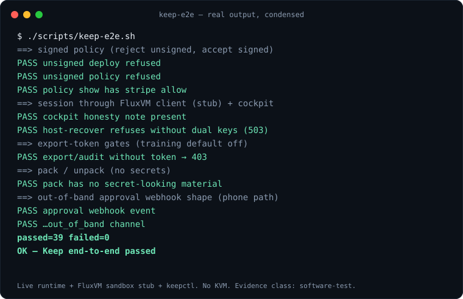

# Keep at a glance

The short version of the open agent workstation; the full pitch is [README.md](README.md). Back to the [README](../../README.md).

## Keep — open agent workstation

<p align="center">
  <a href="README.md"></a>
</p>

**Drop a file. Get answers. Nothing leaves the cell.** Keep reads your files, and runs your agents, inside a sealed cell: a throw-away microVM whose network policy the host sets, with secrets that never enter the cell and approvals signed on your own device.
You run it, you read it, you take it with you. 60+ ready use cases (statements, chats, logs, decks, receipts and bills from photos, bank operations files, and more), and a small JSON file adds another.

| I want to... | Do this |
|---|---|
| **See what it gives me, in two minutes, on this laptop** | `./scripts/keep-demo-local.sh` (macOS or Linux; no KVM, Docker or root). A **simulator, not sealed**: every result says so |
| **Use it on my Mac** | [Solvor](https://github.com/zyvorai/solvor), a native app (macOS 26): drop a file, get the answer, see the proof |
| **Run a real sealed host** | `sudo ./scripts/keep-up.sh` on Linux with KVM (checks, runtime, cell template, a token for Solvor); needs FluxVM. Tested with fake facts and a dry run on a real host; a clean-machine run is still open |
| **Browse what it can read** | [use-case gallery](https://zyvorai.github.io/fabric/keep/packs) · [`examples/keep-agents`](../../examples/keep-agents) · add your own with `./scripts/keepctl init my-pack` |
| **Chat with an agent** | `./scripts/keep-chat.py --agent echo-agent` (a web chat over [AG-UI](AGUI.md); the token stays server-side) |
| **Know what was actually tested** | [VERIFICATION.md](VERIFICATION.md) · [threat model](THREAT-MODEL.md) · [what still needs a person or a resource](TODO.md) |

```bash
./scripts/keep-e2e.sh   # live runtime + FluxVM stub + keepctl, no KVM. passed=39 failed=0
```

**Be precise about the guarantee.** The cell has no network, and a result reports the outbound-connection count as a cross-check; the guarantee is the deny-all policy the host applies before the file enters the cell. The evidence class is `software-test`: whoever operates the host can still read a cell's memory, so run the host yourself. Until Keep 0.2 on real SNP/TDX with a user-held key, this is never marketed as "the operator cannot read this."

| Start here | |
|---|---|
| **Keep README** — pitch, 60-second start, Muse vs Keep | [docs/keep/README.md](README.md) |
| **Phone makers** — an agent computer per user, keys on the phone | [docs/keep/VENDORS.md](VENDORS.md) · [Pages](https://zyvorai.github.io/fabric/keep/phones) |
| Pitch + architecture | [docs/keep/KEEP.md](KEEP.md) |
| Tutorial 16 — workstation | [docs/tutorials/16-keep-workstation.md](../tutorials/16-keep-workstation.md) |
| Tutorial 17 — PDF brief (CONNECT 0) | [docs/tutorials/17-keep-pdf-brief.md](../tutorials/17-keep-pdf-brief.md) |
| Tutorial 18 — seven one-click use cases | [docs/tutorials/18-keep-use-cases.md](../tutorials/18-keep-use-cases.md) |
| Tutorial 19 — build your own use case | [docs/tutorials/19-build-your-own-use-case.md](../tutorials/19-build-your-own-use-case.md) · [pack reference](PACKS.md) |
| Install Keep on a FluxVM host | `./scripts/deploy keep user@host` · [docs/keep/PRODUCTION.md](PRODUCTION.md) |
| Marketing page | console `/keep` · [GitHub Pages](https://zyvorai.github.io/fabric/keep) |
| Lab / CLI | `./scripts/keep-live-lab.sh` · `./scripts/keepctl` (`deploy`, `bundle`, `doctor`) · `./scripts/keep-demo.sh` |
