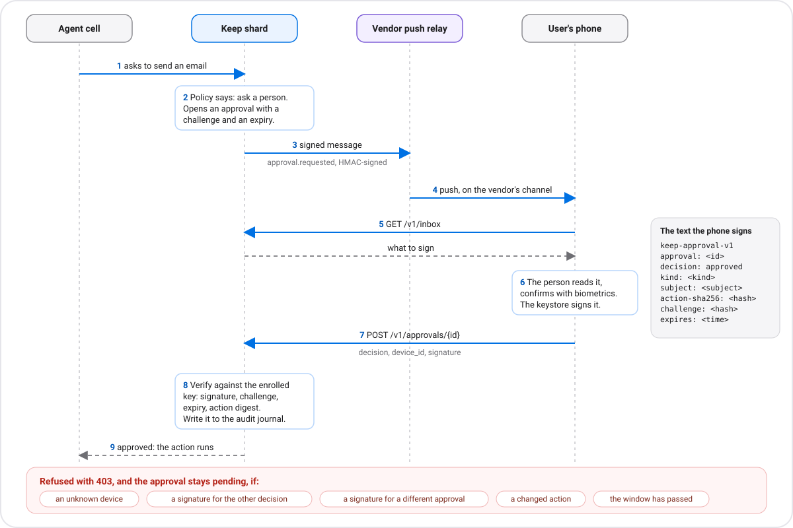

# The phone side of Keep

A user's phone is where they approve what their agent wants to do. This page is for the team building the phone
app (or the vendor gateway behind it). The idea in one line: **the phone holds a private key; Keep holds the
matching public key and only accepts an approval the phone signed.**

```
runtime ──(1) approval opens──> push relay ──> phone
phone   ──(2) GET /v1/inbox ───> runtime           (what is waiting, and what to sign)
phone   ──(3) sign on device
phone   ──(4) POST /v1/approvals/{id} {decision, device_id, signature} ──> runtime  (verified, then recorded)
```



## 1. Enrol the phone

The phone makes a key pair in its hardware-backed keystore and sends the **public** key to *your* gateway after
your own strong login. The gateway enrols it with the operator token (a user token cannot, so a stolen token cannot
add its own key):

```
POST /v1/users/{user_id}/devices          (operator)
{ "device_id": "ana-phone", "alg": "p256", "public_key": "<base64>",
  "push": { "kind": "fcm", "token": "<the device's push address>" } }
```

- `alg`: `p256` (Android Keystore / StrongBox) or `ed25519`.
- `public_key`: base64 of an X.509 SubjectPublicKeyInfo (what Android's `publicKey.encoded` gives), a SEC1 point
  for P-256, or 32 raw bytes for Ed25519.
- Up to 10 devices per user. `GET /v1/users/{id}/devices` lists them (the user can read their own);
  `DELETE /v1/users/{id}/devices/{device_id}` removes one (a lost phone stops signing).

## 2. Wake the phone

Set `ZYVOR_AGENT_PUSH_RELAYS='{"fcm":"https://your-relay.example/push","mipush":"https://…"}'` on the runtime. When an
approval opens, for each of the user's devices whose `push.kind` has a relay, Keep POSTs a signed message to it:

- `x-zyvor-event: approval.requested`, `x-zyvor-signature: sha256=<HMAC-SHA256 of the body>`, keyed with
  `ZYVOR_AGENT_PUSH_RELAY_SECRET` (or the approval webhook's secret). **Verify it.**
- The body names the device and the approval (kind, subject, prompt) and carries the `sign` block below. It never
  carries the request's contents.

Keep does **not** embed FCM, Mi Push, HMS, OPPO or vivo push. The relay is a small service you run that turns this
message into your platform's push. Retries: twice, then an `approval.push` failure is written to the audit journal.

## 3. What to sign

`GET /v1/inbox` (with the user's token) returns the pending approvals; each has a `sign` block:

```json
{ "format": "keep-approval-v1", "challenge": "…32 hex…", "expires_at": 1790000000,
  "action_sha256": "…", "algorithms": ["p256", "ed25519"] }
```

Sign this exact text (UTF-8, every line ends in `\n`), with the decision the person chose:

```
keep-approval-v1
approval: <approval id>
decision: approved            (or: denied)
kind: <kind>
subject: <subject, or empty>
action-sha256: <from sign>
challenge: <from sign>
expires: <expires_at from sign>
```

The text is readable on purpose: show it, or the parts of it a person understands, before they confirm. The
`action-sha256` binds the signature to the exact request that was planned, the `challenge` to this server and this
approval, and `expires` limits how long a signature can be used (default 1 hour, `ZYVOR_AGENT_APPROVAL_SIGN_TTL_SECONDS`).

Signature format: **P-256** is ECDSA over SHA-256, sent as base64 of the DER signature (Java's
`SHA256withECDSA` output) or of the raw 64-byte `r||s`. **Ed25519** is the plain 64-byte signature.

## 4. Decide

```
POST /v1/approvals/{id}       (the user's token, scope "approve")
{ "decision": "approved", "device_id": "ana-phone", "signature": "<base64>" }
```

Refused with **403** (and the approval stays pending) if the device is unknown, the signature does not verify for
this approval and decision (including a signature for the *other* decision, a different approval, or a changed
action), or the window has passed. Every accepted and refused attempt is in the audit journal
(`approval.device_signature`).

**Make it mandatory** for user tokens with `ZYVOR_AGENT_REQUIRE_DEVICE_SIGNATURE=1`, or per credential with
`"require_device_signature": true` in the credentials file. The operator token can always decide without a phone,
for an admin or for a gateway acting on the user's behalf.

## Prove your client agrees with the runtime

[`test-vectors.json`](test-vectors.json) pins the exact payload and signatures for both algorithms (generated by
the runtime's test suite, and re-checked there on every run). A client in any language should reproduce each
`payload` from the `approval` and `sign` fields and verify each `signature`. The Node reference client
(`sdk/agent-runtime/src/phone.js`, `keep-phone` CLI) does exactly this in its tests.

```bash
keep-phone keygen phone.key p256
keep-phone enrol phone.key ana-phone --push-kind fcm --push-token T   # body your gateway POSTs
keep-phone decide phone.key ana-phone approval.json approved          # body the phone POSTs
```

## Android sketch (P-256 in the Keystore)

Illustrative, not a shipped or tested app:

```kotlin
val spec = KeyGenParameterSpec.Builder("keep-approval", KeyProperties.PURPOSE_SIGN)
    .setAlgorithmParameterSpec(ECGenParameterSpec("secp256r1"))
    .setDigests(KeyProperties.DIGEST_SHA256)
    .setUserAuthenticationRequired(true)          // biometric or PIN on every signature
    .setIsStrongBoxBacked(true)                   // fall back on StrongBoxUnavailableException
    .build()
val kp = KeyPairGenerator.getInstance(KeyProperties.KEY_ALGORITHM_EC, "AndroidKeyStore")
    .apply { initialize(spec) }.generateKeyPair()
val publicKeyB64 = Base64.encodeToString(kp.public.encoded, Base64.NO_WRAP)   // enrol this

val sig = Signature.getInstance("SHA256withECDSA").apply {
    initSign(kp.private)                          // wrap in a BiometricPrompt.CryptoObject
    update(payload.toByteArray(Charsets.UTF_8))
}.sign()                                          // DER; base64 it for `signature`
```

## What this proves, and what it does not

- It proves the holder of the **enrolled key** made **this** decision on **this** approval, unaltered and in time.
- It does **not** make the vault user-held: secrets still come from the host environment, and the host operator can
  read them. It does not prove the phone is uncompromised, and a Keystore key only stays on the device if the
  phone's keystore does.
- The user-held unwrap ceremony (`/v1/vault/user-held/*`) still does not verify a device assertion; it stays
  refused until confidential hardware is verified ([KEEP-0.2.md](../KEEP-0.2.md)).
