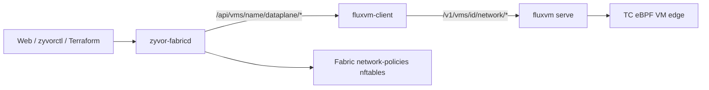
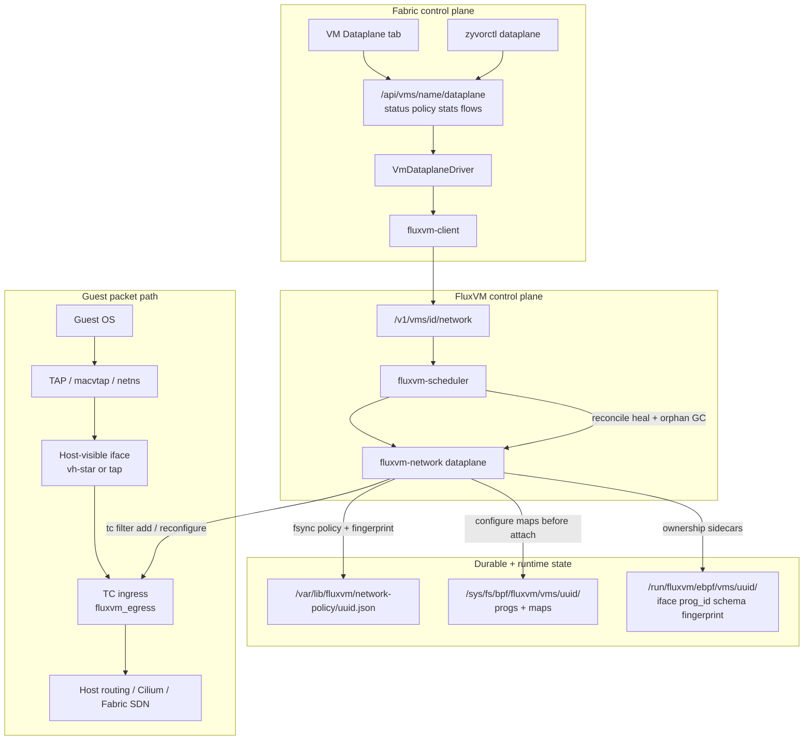
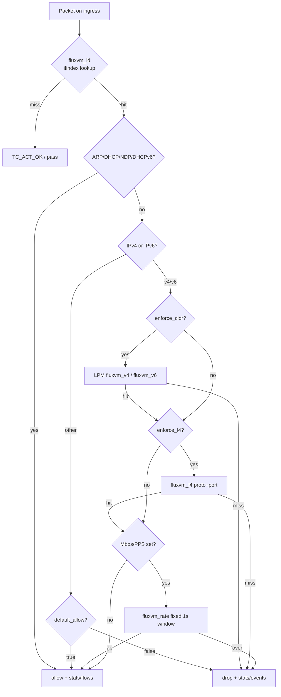
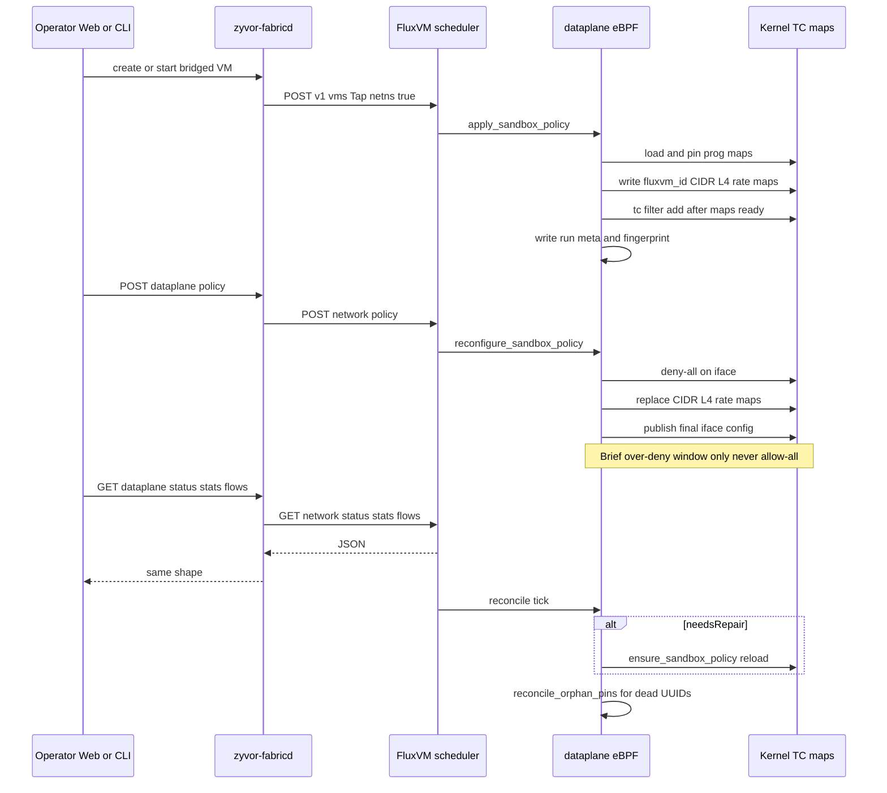
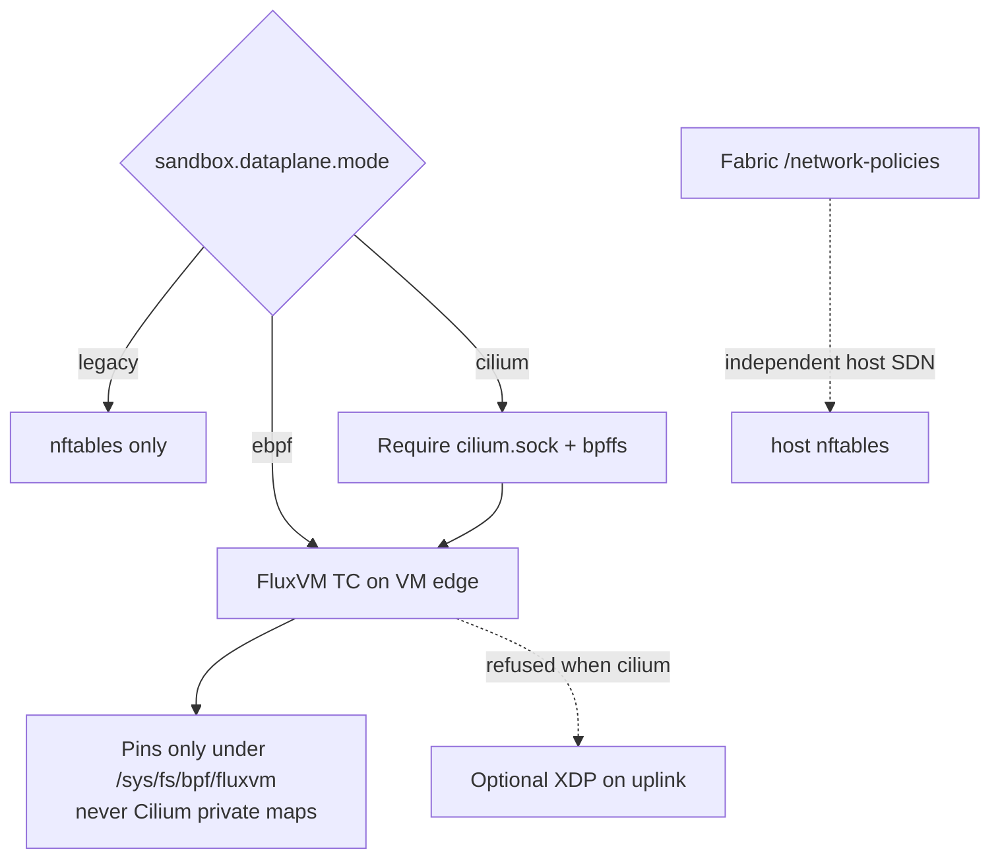
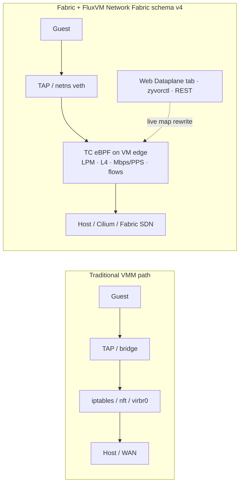
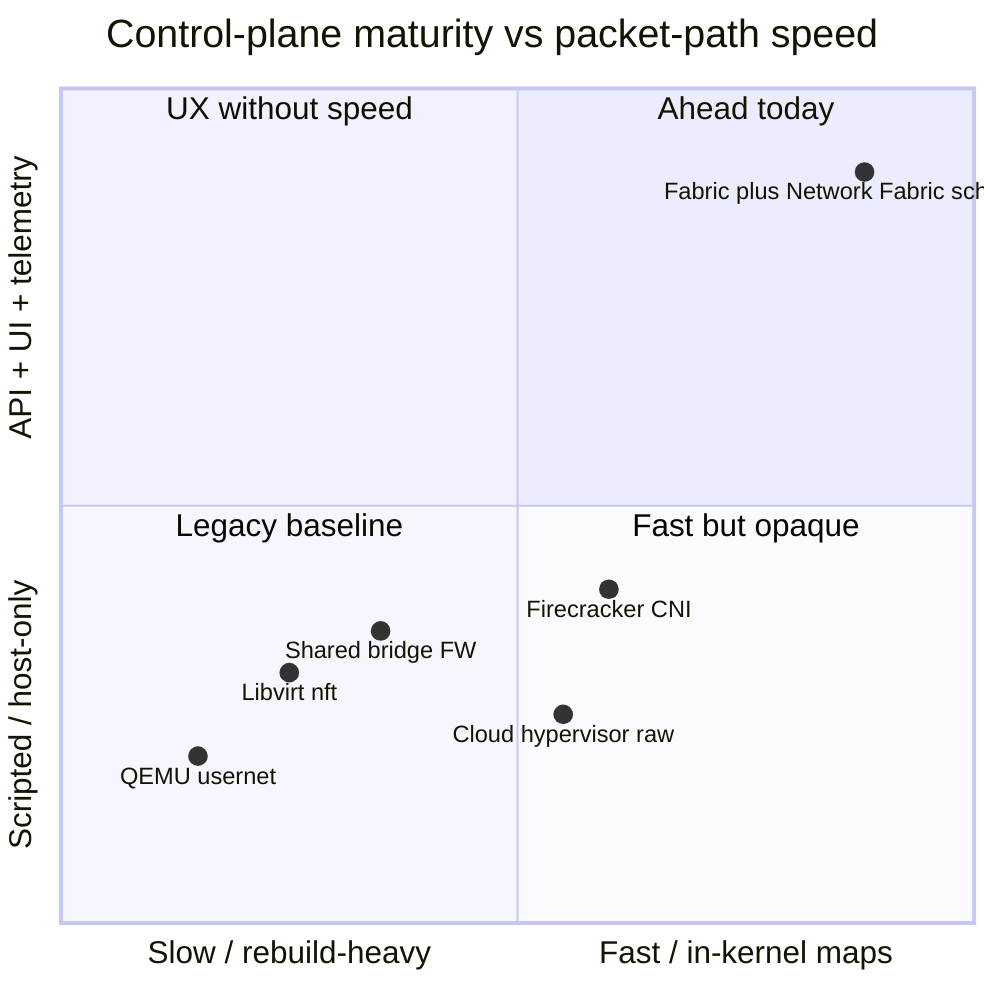

# Network Fabric architecture (how it works)

This is the deep technical dive into Fabric's VM-edge dataplane. For the short version, see [README.md — Architecture](../README.md#architecture-fluxvm--guestkit); for the operator guide (enablement, troubleshooting, UX checklist), see [docs/guides/vm-drivers/fluxvm-dataplane.md](guides/vm-drivers/fluxvm-dataplane.md).

Fabric exposes FluxVM **Network Fabric schema v4** (TC/eBPF VM-edge dataplane) as first-class API, CLI, and UI — while keeping Fabric's own host SDN separate. Kernel program source of truth: [FluxVM Network Fabric](https://github.com/zyvorai/fluxvm#network-fabric-architecture-how-it-works).

## Two policy planes (do not conflate)

| Plane | Owns | API / UX |
|-------|------|----------|
| **Fabric SDN** | Host isolation (label → nftables) | `/api/network-policies` · Security → Network Policies |
| **VM edge (Network Fabric schema v4)** | Per-VM allowlists, Mbps/PPS, stats/flows on the TAP/netns edge | `/api/vms/{name}/dataplane/*` · VM → **Dataplane** tab · `zyvorctl dataplane …` |
| **Service Fabric v6** (BPF schema 4 / gen 6) | Maglev VIP LB + EDT/FluxScope/host-routing + leases + HA deltas + identity/L7 policy | `/api/dataplane/services…` · Edge Dataplane → **Services** · [docs/ebpf-service-fabric.md](ebpf-service-fabric.md) |



## Big picture (Fabric + FluxVM + kernel)



## Namespaced TAP path (what Fabric bridged VMs use)

Fabric creates bridged VMs with `NetworkSpec::Tap { netns: true }`. The classifier attaches on the **host** veth (`vh-…`), not inside the guest:


Direct TAP/macvtap (non-netns) attaches on the host-visible TAP/macvtap itself.

## Packet decision inside the TC program



## Control-plane lifecycle (through Fabric)



## Where state lives

| Location | Contents |
|----------|----------|
| Fabric API | Name-keyed proxy; resolves VM name → FluxVM UUID via `fluxvm-client` |
| `/sys/fs/bpf/fluxvm/vms/<uuid>/` | Pinned TC program + maps (`fluxvm_id`, `v4`, `v6`, `l4`, `rate`, `stats`, `flows`, `events`) |
| `/run/fluxvm/ebpf/vms/<uuid>/` | `iface`, `prog_id`, `schema_version`, `policy_fingerprint` (not on bpffs) |
| `/run/fluxvm/xdp/` | Optional XDP `iface` + `prog_id` |
| `/var/lib/fluxvm/network-policy/<uuid>.json` | Durable per-VM policy (fsync + rename) |

## Modes vs ownership



## REST surface (Fabric ↔ FluxVM)

| Fabric | FluxVM | Role |
|--------|--------|------|
| `GET …/dataplane/status` | `GET …/network/status` | mode, attached, schema_version, policy_synced, iface |
| `GET/POST …/dataplane/policy` | `GET/POST …/network/policy` | Read / replace durable policy (+ live map update) |
| `GET …/dataplane/stats` | `GET …/network/stats` | allow/drop packet + byte counters |
| `GET …/dataplane/flows?limit=` | `GET …/network/flows?limit=` | LRU flows with `family` 4/6 |

```bash
zyvorctl dataplane status <name>
zyvorctl dataplane policy get|set <name> [--file policy.json]
zyvorctl dataplane stats <name>
zyvorctl dataplane flows <name> [--limit 100]
```

HTTPS labs: `export ZYVOR_FABRIC_URL=https://127.0.0.1:9095` and `export ZYVOR_FABRIC_TOKEN=<jwt>` (from `/api/auth/login`).

## Enable packaging

Ship [`configs/fluxvm-dataplane.toml`](../configs/fluxvm-dataplane.toml) (`mode = "ebpf"`). Compose/k8s mount it as `/etc/fluxvm.toml`, mount host `/sys/fs/bpf`, and raise memlock (`SYS_RESOURCE` / `ulimit memlock=-1`). Image must include `/usr/lib/fluxvm/bpf/fluxvm_tc.bpf.o`. After first green attach (`schema_version=4`, `attached=true`), set `required = true` for fail-closed production.

## Why Fabric + Network Fabric is ahead of other VMMs

Most hypervisor stacks still treat VM egress as **host netfilter theater**: libvirt/iptables chains, a shared bridge + firewall, or QEMU user-mode NAT. Fabric puts **operator UX (API · Web · CLI)** on top of FluxVM's **TC/eBPF VM-edge dataplane**, so policy, rate limits, and telemetry are first-class — not afterthought scripts.





| Capability | libvirt / virsh + nft | Shared bridge + host FW | QEMU user NAT | Typical microVM + CNI | **Fabric + Network Fabric schema v4** |
|---|---|---|---|---|---|
| Per-VM L3/L4 egress allowlists | Manual chains | Host-wide rules | Soft / limited | Pod-oriented | **First-class** `allow_cidrs` + `tcp\|udp/PORT` |
| Live policy without detach | Flush/reload gaps | Blast radius | Restart usernet | CNI reconcile | **In-place BPF map update** (~100–120 ms p50 in lab) |
| Mbps / PPS egress caps | Separate tc/htb | Rare | Soft | Depends on CNI | **Maps on the same classifier** |
| Dual-stack L3+L4 | Easy to drift | Often IPv4-only | Limited | Varies | **One TC program** |
| Per-VM stats + LRU flows via API | tcpdump / conntrack | Host-centric | Almost none | Sidecar / Hubble-ish | **`/dataplane/stats` + `/flows`** |
| Operator UX | virsh + shell | Same | Same | kubectl-heavy | **VM → Dataplane tab · `zyvorctl dataplane` · 4 REST verbs** |
| Host SDN still available | You build it | You build it | N/A | NetworkPolicy | **Fabric `/network-policies` orthogonal** |
| Cilium coexistence | iptables fights | Same | N/A | Native | **`mode=cilium` — FluxVM owns VM edge only** |

> The ~100–120ms p50 map-update figure above is a lab observation from the development environment, not a published benchmark with a documented methodology across hardware/kernel versions — treat it as indicative, not a guaranteed SLA.

**Shipped in Fabric UX (all wired; lab UX verified):**

| Surface | Status · Policy · Stats · Flows |
|---------|----------------------------------|
| Web | VM details → **Dataplane** (presets, JSON, identity column, auto-refresh) |
| REST | `/api/vms/{name}/dataplane/{status,policy,stats,flows}` |
| CLI | `zyvorctl dataplane …` (`ZYVOR_FABRIC_URL` + `ZYVOR_FABRIC_TOKEN` for HTTPS labs) |
| Dashboard | **VM dataplane** capability card (`mode` / attached / schema) |

Operator guide (enablement, create-bridged recipe, troubleshooting, UX checklist): [docs/guides/vm-drivers/fluxvm-dataplane.md](guides/vm-drivers/fluxvm-dataplane.md). User console: [docs/user/pages/infrastructure/dataplane.md](user/pages/infrastructure/dataplane.md).

Kernel program SoT: [FluxVM — Why Network Fabric is faster](https://github.com/zyvorai/fluxvm#why-network-fabric-is-faster-than-traditional-vm-networking).
