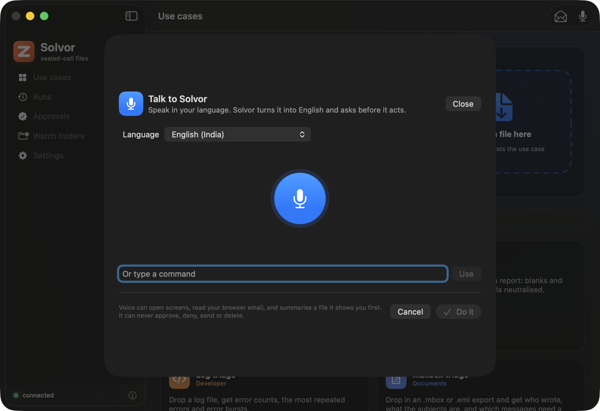
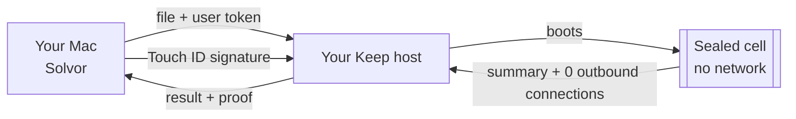

<p align="center">
  
</p>

<h1 align="center">Solvor</h1>

<p align="center">
  <b>Drop a file. Get answers. Nothing leaves the cell.</b><br>
  A native Mac app for <a href="https://github.com/zyvorai/fabric">Keep</a>: every file is read inside a sealed cell that has no network,<br>
  and every result shows the proof, the number of outbound connections the cell made.
</p>

<p align="center">
  <a href="https://github.com/zyvorai/solvor/actions/workflows/ci.yml"></a>
  
  
  
</p>

<p align="center">
  
</p>

## Why

Statements, chat exports, contracts, logs, decks, receipts: the files people most want summarised are the ones they least
want to upload to a service that keeps them. Solvor sends the file to a **Keep host you run**. The host boots a throw-away
microVM with no network, reads the file there with a fixed extractor (no model is involved unless a use case says so and your
host allows it), returns the summary, and throws the cell away. Solvor shows the result and what the cell did.

## What you can do

| | |
|---|---|
| **Drop anything** | Drag a file on the window (or a card, the menu bar, Finder's Services menu). Solvor suggests the use case from the file type; several files run as one batch, one cell each. |
| **60+ use cases** | Documents, phone exports, Mac and Windows reports, developer tools, browser exports and office sheets. The list comes from your host, so your own packs appear too. |
| **Read an email from your browser** | One click reads the front tab of Safari, Chrome, Brave, Edge or Arc. You review and edit the text, redaction hides one-time codes, long account numbers and tracking parameters, and Solvor suggests the matching use case. |
| **Talk to it** | Speak in your language; Speech transcribes, Apple's on-device Translation makes English, a fixed set of commands is recognised, and Solvor asks before it acts. Siri and Shortcuts can start the same actions. |
| **Watch folders** | A rule (folder, patterns, use case) runs each new file once and can save `name.keep.md` next to it. |
| **Approve with Touch ID** | Approvals are signed in the Secure Enclave over the exact text the host will check. Voice, Siri and Shortcuts can never approve or deny. |
| **History** | Every run is kept; open one, or compare two. |

<table>
  <tr>
    <td></td>
    <td></td>
    <td></td>
  </tr>
  <tr>
    <td align="center">Read a browser email, with a redaction preview</td>
    <td align="center">Talk to Solvor</td>
    <td align="center">The proof on every result</td>
  </tr>
</table>

## How it works



- The token lives in the macOS **Keychain** (this device only) and is sent only in the `Authorization` header.
- Before an upload Solvor scans the name and the first 512 KB for private keys, cloud and token strings and `.env`-style files,
  and asks first. It never echoes a secret.
- Email and voice are **user-triggered only**. Nothing is read in the background, nothing is sent to the mail site, and Solvor never
  sends, replies, deletes or clicks anything.
- **Be precise about the guarantee.** The evidence class is `software-test`: the cell has no network, and the result reports 0
  outbound connections, but whoever operates the host could still read a cell's memory. Solvor says so in Settings and on every result.

## Quick start

You need a Keep host ([zyvorai/fabric](https://github.com/zyvorai/fabric), on a Linux machine with FluxVM) and a scoped **user token**
(`POST /v1/user-tokens`, scopes `read run approve`), not the operator token. Solvor needs **macOS 26** (Tahoe) and Xcode 26 to build: it is built on the Liquid Glass styles.

```bash
make run                       # builds and opens Solvor (ad-hoc signed, runs on the Mac that built it)
brew install xcodegen          # only if you change project.yml, then: make project
```

Open **Settings**, enter the host (for example `http://127.0.0.1:9096` through `ssh -L 9096:127.0.0.1:9096 you@host`), your token and user
id, and connect. For a debug login without the Keychain prompt:

```bash
make run KEEP_HOST=http://127.0.0.1:9096 KEEP_TOKEN=kut1.…   # debug builds only; release builds ignore these
```

`make help` lists the rest: `test`, `test-kit`, `test-app`, `project`, `catalog`, `icon`, `stop`, `clean`.

## Layout

```
Sources/KeepKit/     the client library, no UI: API client, Keychain token store, Secure Enclave approval signing,
                     secret scan, folder rules, email builder / redactor / router, voice command parser, pack catalogue
Sources/Solvor/      the SwiftUI app
Tests/               KeepKit unit tests (live tests run only with KEEP_API and KEEP_TOKEN) and app tests
tools/               icon generator, pack catalogue generator
project.yml          XcodeGen spec; Solvor.xcodeproj is generated from it and committed
```

Liquid Glass throughout (cards, buttons, sidebar) in the system accent colour. The only orange is the Zyvor mark.

## Honest status

Verified against a real Keep host with real cells: connecting and listing, running files, batches, the watched-folder flow end to end, the
email pipeline (page text to `.eml` to a use case), and approval signing against the runtime's own test vectors.

Built but **not verified** here, because each needs your permission or your hardware: reading a real logged-in webmail page (needs
macOS Automation permission and the browser's "Allow JavaScript from Apple Events"), Siri and Shortcuts registration, the microphone,
Speech and Translation, the Services entry, the `keep://` URL scheme, and approving a waiting request.

Not included: a signed, notarized or App Store build (it is ad-hoc signed and runs on the Mac that built it), a push relay (approvals are
polled every 20 s while the app runs), a Share-sheet extension, and Firefox email reading (Firefox has no scripting interface).

## Where this lives

This repository is a **snapshot** of [`integrations/macos-keep`](https://github.com/zyvorai/fabric/tree/main/integrations/macos-keep) in
[zyvorai/fabric](https://github.com/zyvorai/fabric), which is the source of truth for Solvor, the Keep runtime, the API and the packs.
Design notes and the API mapping: [docs/keep/MACOS-APP.md](https://github.com/zyvorai/fabric/blob/main/docs/keep/MACOS-APP.md).
Please open issues and pull requests there.

## License

Apache-2.0. See [LICENSE](LICENSE).
